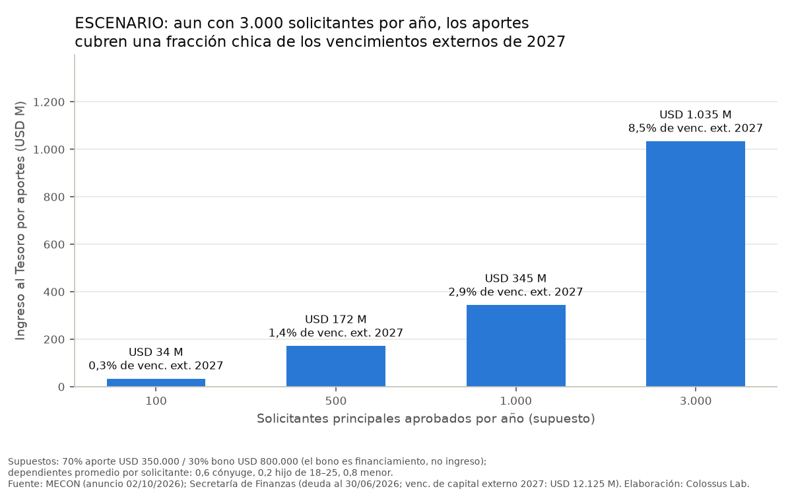

# Ciudadanía por Inversión y el "momento Argentina"

Colossus Lab · Informe generado el 2026-10-03 · Etiquetas: <b>DATO</b> (fuente directa) · <b>ESTIMACIÓN</b> (cálculo propio) · <b>HIPÓTESIS</b> (interpretación) · <b>ESCENARIO</b> (proyección condicional). Cada DATO tiene su cita literal en <code>docs/claims_ledger.csv</code>, auditada contra la copia local (<code>docs/auditoria.csv</code>).

## Módulo A — Marco normativo

**Resumen (5 líneas)**
1. **DATO:** El anuncio del 02/10/2026 fija USD 350.000 de aporte no reembolsable al Tesoro, o USD 800.000 en un título público específico; USD 100.000 por cónyuge e hijos de 18–25 años, y USD 25.000 por menor. Total para una familia tipo: USD 500.000. Las solicitudes se reciben desde el 4T-2026 (A01–A06).
2. **DATO:** La base legal es el DNU 366/2025 (art. 37 → Ley 346 art. 2 inc. 2: "inversión relevante", sin requisito de residencia). **El DNU no fija ningún monto**: delega en el Ministerio de Economía (art. 2 bis). La cifra de "USD 500.000" que citó la prensa **no figura** en el texto del DNU (A09–A10).
3. **DATO:** A la fecha de consulta (03/10/2026), InfoLEG no registra ninguna resolución del Ministerio de Economía que fije los montos anunciados. Los montos hoy constan solo en un anuncio, no en una norma (A17).
4. **DATO — riesgo jurídico central:** la Cámara Nacional Electoral declaró **nulo** el DNU 366/2025 el 30/06/2026 (causa "Yang"). Sostuvo que la ciudadanía es materia electoral vedada a los DNU (art. 99 inc. 3 CN). El Juzgado Federal de Esquel declaró inconstitucional, para el caso, el art. 37 (que crea la vía por inversión) (A18–A20).
5. **HIPÓTESIS:** el control de constitucionalidad en Argentina tiene efecto para el caso. Por eso el programa puede operar, pero cada carta de ciudadanía por inversión queda expuesta a impugnación judicial hasta que haya ley del Congreso o fallo de la Corte Suprema. No se encontró rechazo del DNU en ninguna cámara del Congreso, ni sentencia de la CSJN (búsqueda en prensa; pendiente de verificar en fuente primaria).

### Lo que no se pudo verificar en fuente primaria
- Dictamen de la Comisión Bicameral Permanente sobre el DNU 366/2025: el sitio de HCDN no expone un listado accesible. La prensa (Infobae, 05/01/2026; Parlamentario, 04/07/2026) indica que no hubo dictamen. Esto queda como **S** (solo para fechar).
- Si la causa "Yang" fue llevada a la CSJN por recurso extraordinario: no hay evidencia pública.
- La copia de las sentencias proviene de un enlace publicado por *Palabras del Derecho*. Los PDF llevan firma digital del PJN (fecha de firma y firmantes visibles); conviene contrastarlos con el sistema de consulta del PJN.

### Archivos
- `src/01_normativa.py` → `data/processed/A_cronologia.csv`, `docs/claims/claims_A.csv`

## Módulo G — Escenarios fiscales

**Resumen (5 líneas)**
1. **ESCENARIO:** con 1.000 solicitantes principales por año (70% aporte / 30% bono), los aportes al Tesoro suman ≈ USD 345 M/año. Eso es el 2,9% de los vencimientos de capital de deuda externa de 2027 y el 0,75% de las reservas brutas (G04).
2. **ESCENARIO:** el techo del rango analizado es 3.000 solicitantes/año, todos por aporte: USD 1.350 M/año, el 11% de los vencimientos de capital externo de 2027 (G05). Para ubicar esa cifra, ver los volúmenes que logran otros programas en el Módulo C.
3. **DATO:** reservas brutas del BCRA de USD 46.092 M al 30/09/2026 (G01); vencimientos de capital de la deuda externa de la Administración Central en 2027: USD 12.125 M (G02). Servicios totales de la deuda (todas las monedas) entre jul-2026 y jun-2027: USD 147.930 M (G03).
4. **HIPÓTESIS:** el bono de USD 800.000 no es ingreso, es financiamiento. Su valor fiscal neto depende de la tasa y el plazo, que no se publicaron. Solo los aportes (y los de los dependientes) son recursos no reembolsables.
5. **HIPÓTESIS:** el programa puede ser relevante como señal o como fuente de divisas marginal, pero no cambia por sí solo la ecuación de deuda. Además, su flujo está expuesto al riesgo judicial del DNU 366/2025 (Módulo A).

### Supuestos (todos de ESCENARIO, editables en `src/07_escenarios.py`)
- Solicitantes principales aprobados por año: 100 / 500 / 1.000 / 3.000.
- Canal: 100% aporte; 70/30; 50/50 entre aporte (USD 350.000) y bono (USD 800.000).
- Dependientes promedio por solicitante: 0,6 cónyuges, 0,2 hijos de 18 a 25 y 0,8 menores, lo que da USD 100.000 de aportes de dependientes por solicitante. Se asume que los dependientes aportan en efectivo aunque el principal elija el bono: el anuncio dice que deben realizar "los aportes previstos para cada categoría".
- No se incluyen tasas administrativas ni de debida diligencia (no fueron anunciadas).

### Tabla completa
`data/processed/G_escenarios.csv` (ingreso al Tesoro, financiamiento vía bono y % sobre cada base).

### Fuentes
| Fuente | Tipo | URL |
|---|---|---|
| BCRA, API Estadísticas v4.0, variable 1 (reservas internacionales) | P | https://api.bcra.gob.ar/estadisticas/v4.0/monetarias/1 |
| Secretaría de Finanzas, Deuda pública al 30/06/2026 (hojas A.3.1 y A.4.6) | P | https://www.argentina.gob.ar/sites/default/files/deuda_publica_30-06-2026_0.xlsx |

### Fuentes fallidas
| Fecha | Fuente | Error | Acción |
|---|---|---|---|
| 2026-10-03 | api.bcra.gob.ar v3.0 | 410 Gone | Se usó la v4.0 |

### Limitaciones
- No hay ningún dato de demanda: el programa no estaba operativo. Los escenarios no son pronósticos.
- Los servicios totales de la deuda (G03) incluyen deuda en pesos convertida a USD. Para medir presión cambiaria, la base relevante es G02.
