# Ciudadanía por Inversión y el "momento Argentina"

Colossus Lab · Informe generado el 2026-10-03 · Etiquetas: <b>DATO</b> (fuente directa) · <b>ESTIMACIÓN</b> (cálculo propio) · <b>HIPÓTESIS</b> (interpretación) · <b>ESCENARIO</b> (proyección condicional). Cada DATO tiene su cita literal en <code>docs/claims_ledger.csv</code>, auditada contra la copia local (<code>docs/auditoria.csv</code>).

## Resumen ejecutivo

El 02/10/2026 el Ministerio de Economía anunció el Programa de Ciudadanía por Inversión (CBI). Este estudio pregunta cuatro cosas: si la base legal resiste, quién podría comprar, cuánto aportaría y si el "momento Argentina" que lo justifica se sostiene con datos.

### Las respuestas, en una línea cada una

| Pregunta | Respuesta | Etiqueta |
|---|---|---|
| ¿Cuánto cuesta? | USD 350.000 de aporte o USD 800.000 en un bono. Una familia tipo paga USD 500.000. Las solicitudes se reciben desde el 4T-2026 (A01–A06) | DATO |
| ¿Tiene base legal firme? | **No.** El DNU 366/2025 no fija montos: delega en Economía qué inversión es "relevante". Al 03/10/2026 no hay ninguna norma publicada con los montos anunciados, y la Cámara Nacional Electoral declaró nulo el DNU el 30/06/2026 (A10, A17, A18, A20) | DATO |
| ¿Es caro o barato? | Es el programa verificado más caro: 1,4–1,5 veces la donación caribeña, o 2,0–2,2 veces para una familia. A cambio ofrece un pasaporte con más destinos sin visa que cualquier programa caribeño (C80–C83) | ESTIMACIÓN |
| ¿Quién podría comprarlo? | En EE.UU., 4,8 M de hogares superan USD 5 M de patrimonio, y para ellos el aporte es menos del 4% (B03–B07). Pero a un estadounidense el pasaporte argentino le abre solo 7 destinos nuevos. La ganancia de movilidad se concentra en China, India, Rusia y los países del Golfo (B31–B43) | ESTIMACIÓN / HIPÓTESIS |
| ¿Cuánto recaudaría? | Con 1.000 solicitantes por año, unos USD 345 M (el 2,9% de los vencimientos externos de 2027). Para igualar a los cinco programas del Caribe juntos (USD 492 M/año) harían falta unos 1.430 solicitantes por año (G04–G06, C90) | ESCENARIO |
| ¿Argentina está "de moda" desde Qatar? | **Parcialmente.** Hubo un escalón de atención que en Wikipedia ya se disipó y en Google persiste moderado. El turismo desde EE.UU. creció menos que el resto de Sudamérica (E07–E15, E32) | ESTIMACIÓN |
| ¿Se busca el pasaporte argentino? | **Sí, y cada vez más.** En EE.UU., "argentina passport" pasó de un índice promedio de 2 a 4 (2021–2024) a 32,5 en 2026. El anuncio generó un pico mundial inmediato, y "argentina citizenship by investment program" fue la búsqueda relacionada de mayor ascenso (+1.300%) (E50–E64) | DATO / ESTIMACIÓN |
| ¿Es un "refugio austral"? | **Solo en recursos.** Argentina lidera en alimentos, litio y energía, pero queda última de seis comparables en todos los indicadores de instituciones, paz y estabilidad macro (F001–F122) | DATO / HIPÓTESIS |
| ¿Ayuda a entrar sin visa a EE.UU.? | Hoy no: el pasaporte argentino necesita visa para EE.UU. En 2025 se firmó una declaración de intención para el reingreso al Visa Waiver Program (D28). La CBI puede jugar en contra, porque EE.UU. sacó a Argentina en 2002 cuestionando la integridad de sus documentos (D27) | DATO / HIPÓTESIS |

### Los tres riesgos que más pesan

1. **Riesgo judicial (DATO).** La Cámara Nacional Electoral resolvió "declarar nulo el decreto de necesidad y urgencia N° 366/2025" porque la ciudadanía es materia electoral, vedada a los DNU (A18). El Juzgado Federal de Esquel declaró inconstitucional el art. 37, que es justamente el que crea la vía por inversión (A20). **HIPÓTESIS:** como el control judicial argentino vale para cada caso, cada carta de ciudadanía por inversión queda expuesta a impugnación hasta que haya una ley del Congreso o un fallo de la Corte Suprema.
2. **Riesgo regulatorio externo (DATO).** El Reglamento (UE) 2025/2441 convirtió la CBI "sin vínculo genuino" en causal de suspensión de la exención de visa Schengen, y Argentina figura en el Anexo II (B32–B33). Vanuatu ya la perdió por ese motivo, y EE.UU. restringió la entrada de nacionales de Antigua y Dominica por su CBI sin residencia (C50–C57). Lo que estaría en juego es el acceso Schengen de **todos** los argentinos.
3. **Riesgo de expectativas (ESCENARIO).** Ni el escenario más alto (3.000 solicitantes por año, USD 1.350 M) cubre más del 11% de los vencimientos de capital externo de 2027. Esa cifra es, además, más del doble de lo que recauda todo el Caribe junto.

### Qué no se pudo verificar
- La tasa de rechazo de visas B de EE.UU. para Argentina en FY2025: la copia de archivo no fue accesible desde el entorno (Módulo D).
- El dictamen de la Comisión Bicameral sobre el DNU 366/2025, y si la causa "Yang" llegó a la Corte Suprema.
- El resultado de Argentina en el Mundial 2026: no se asume.
- Si China e India permiten la doble nacionalidad, de lo que depende el ranking de mercados (Módulo B).
- Los montos de Dominica, Vanuatu, Jordania y Egipto (Módulo C).

### Cómo leer este informe
Cada afirmación lleva un código (A01, B31…) que remite a `docs/claims_ledger.csv`. Ahí figuran la fuente, el archivo local, su hash y la cita literal o el localizador. `src/09_auditoria.py` verifica cada cita contra la copia descargada; el resultado está en `docs/auditoria.csv`.

## Módulo A — Marco normativo

**Resumen (5 líneas)**
1. **DATO:** El anuncio del 02/10/2026 fija USD 350.000 de aporte no reembolsable al Tesoro, o USD 800.000 en un título público específico; USD 100.000 por cónyuge e hijos de 18–25 años, y USD 25.000 por menor. Total para una familia tipo: USD 500.000. Las solicitudes se reciben desde el 4T-2026 (A01–A06).
2. **DATO:** La base legal es el DNU 366/2025 (art. 37 → Ley 346 art. 2 inc. 2: "inversión relevante", sin requisito de residencia). **El DNU no fija ningún monto**: delega en el Ministerio de Economía (art. 2 bis). La cifra de "USD 500.000" que citó la prensa **no figura** en el texto del DNU (A09–A10).
3. **DATO:** A la fecha de consulta (03/10/2026), InfoLEG no registra ninguna resolución del Ministerio de Economía que fije los montos anunciados. Los montos hoy constan solo en un anuncio, no en una norma (A17).
4. **DATO — riesgo jurídico central:** la Cámara Nacional Electoral declaró **nulo** el DNU 366/2025 el 30/06/2026 (causa "Yang"). Sostuvo que la ciudadanía es materia electoral vedada a los DNU (art. 99 inc. 3 CN). El Juzgado Federal de Esquel declaró inconstitucional, para el caso, el art. 37 (que crea la vía por inversión) (A18–A20).
5. **HIPÓTESIS:** el control de constitucionalidad en Argentina tiene efecto para el caso. Por eso el programa puede operar, pero cada carta de ciudadanía por inversión queda expuesta a impugnación judicial hasta que haya ley del Congreso o fallo de la Corte Suprema. No se encontró rechazo del DNU en ninguna cámara del Congreso, ni sentencia de la CSJN (búsqueda en prensa; pendiente de verificar en fuente primaria).

### Lo que no se pudo verificar en fuente primaria
- Dictamen de la Comisión Bicameral Permanente sobre el DNU 366/2025: el sitio de HCDN no expone un listado accesible. La prensa (Infobae, 05/01/2026; Parlamentario, 04/07/2026) indica que no hubo dictamen. Esto queda como **S** (solo para fechar).
- Si la causa "Yang" fue llevada a la CSJN por recurso extraordinario: no hay evidencia pública.
- La copia de las sentencias proviene de un enlace publicado por *Palabras del Derecho*. Los PDF llevan firma digital del PJN (fecha de firma y firmantes visibles); conviene contrastarlos con el sistema de consulta del PJN.

### Fuentes
| Fuente | Tipo | URL |
|---|---|---|
| Ministerio de Economía, anuncio 02/10/2026 | P | https://www.argentina.gob.ar/noticias/luis-caputo-anuncio-la-puesta-en-marcha-del-programa-de-ciudadania-por-inversion-de |
| DNU 366/2025, Boletín Oficial 29/05/2025 | P | https://www.boletinoficial.gob.ar/detalleAviso/primera/326096/20250529 |
| InfoLEG: normas que modifican/complementan el DNU 366/2025 | P | https://www.argentina.gob.ar/normativa/nacional/norma-413297/normas-modifican |
| Decreto 524/2025, BO 31/07/2025 | P | https://www.boletinoficial.gob.ar/detalleAviso/primera/329061/20250731 |
| Decreto 285/2026, BO 28/04/2026 | P | https://www.boletinoficial.gob.ar/pdf/aviso/primera/341227/20260428 |
| CNE, "Yang, Liping", Expte. 8843/2023/CA1, 30/06/2026 (copia vía Palabras del Derecho) | P | https://drive.google.com/file/d/1xWgM2IK8QeBFwmNogXJqYmY9RNC7z6gn |
| Juzgado Federal de Esquel, Expte. 10640/2025, 12/08/2026 (copia vía Palabras del Derecho) | P | https://drive.google.com/file/d/1m8JzZS80fcB-ENA-lI-0gr5Ii01sURig |
| Palabras del Derecho, notas del 30/06/2026 y 26/08/2026 | S | palabrasdelderecho.com.ar/articulo/6845 y /6940 |

### Fuentes fallidas
| Fecha | Fuente | URL | Error | Causa | Acción |
|---|---|---|---|---|---|
| 2026-10-03 | HCDN, Comisión Bicameral Permanente | https://www.hcdn.gob.ar/comisiones/especiales/ | La página no lista los dictámenes (contenido dinámico) | Sitio | Prensa (tipo S) solo para fechar; queda "no verificado" |
| 2026-10-03 | InfoLEG, buscador de normas | https://www.argentina.gob.ar/normativa/buscar | La búsqueda por texto no devuelve resultados al pedido automatizado | Sitio | Se usó la ficha "normas que modifican" del DNU 366/2025 |

### Archivos
- `src/01_normativa.py` → `data/processed/A_cronologia.csv`, `docs/claims/claims_A.csv`

## Módulo B: mercado potencial

**Fecha:** 2026-10-03 · **Script:** `src/02_mercado.py` · **Afirmaciones:** `docs/claims/claims_B.csv` (B01–B43)

### Resumen (5 líneas)

1. **ESTIMACIÓN:** en EE.UU. hay unos 4,8 M de hogares con patrimonio neto > USD 5 M y 2,1 M > USD 10 M (SCF 2022, en dólares de 2022). Para el tramo > USD 5 M, el aporte de USD 350.000 equivale al 3,8 % del patrimonio mediano (B03, B04, B07).
2. **DATO:** el top 0,1 % de EE.UU. (136.779 hogares) tiene USD 27,9 billones, el 15,0 % del patrimonio de los hogares al 2T-2026. Con el resto del top 1 %, el grupo suma el 32,5 % (B12, B13, B15, B16). **ESTIMACIÓN:** para un hogar promedio del top 0,1 %, el aporte es el 0,17 % de su patrimonio (B18).
3. **ESTIMACIÓN / HIPÓTESIS:** el índice millonarios × brecha de destinos sin visa × visa Schengen solo da positivo en 7 de los 34 mercados con datos de UBS. China lidera con holgura (100), seguida por India (23), Arabia Saudita (6) y Rusia (4) (B31, B40). Sin el indicador Schengen, son 10 mercados (B41).
4. **Contrapeso, ESTIMACIÓN:** en 24 de esos 34 mercados, que reúnen 44,7 M de los 53,3 M de millonarios de la tabla, el pasaporte argentino no agrega destinos (B39). A un estadounidense le abre solo 7 destinos: China, Brasil, Rusia, Irán, Venezuela, Bielorrusia y Uzbekistán (B43). Además, el pasaporte argentino necesita visa para entrar a EE.UU. (B37).
5. **Contrapeso, DATO:** desde el Reglamento (UE) 2025/2441, que un país del Anexo II tenga un programa de ciudadanía por inversión sin "vínculo genuino" es causal para suspenderle la exención de visa Schengen. Argentina está en ese anexo (B32, B33). Ese mismo argumento le costó a Vanuatu la exención (B34, B35).

---

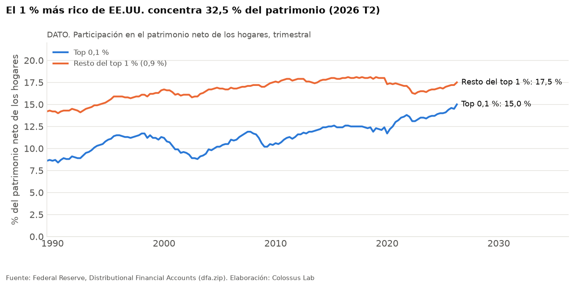
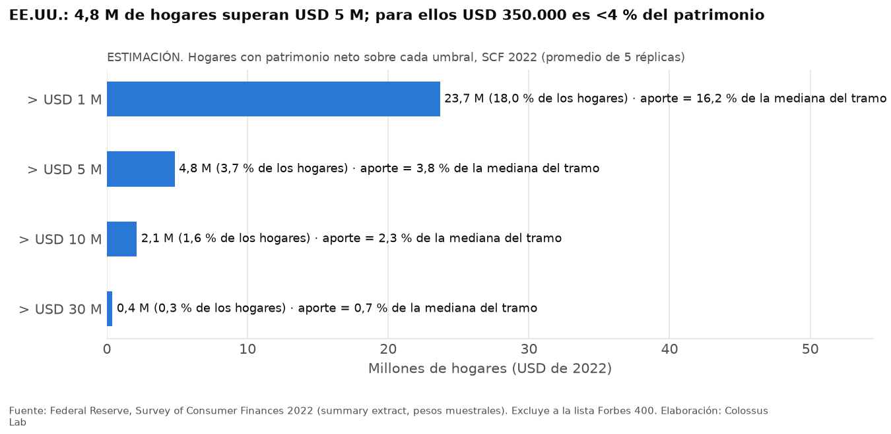
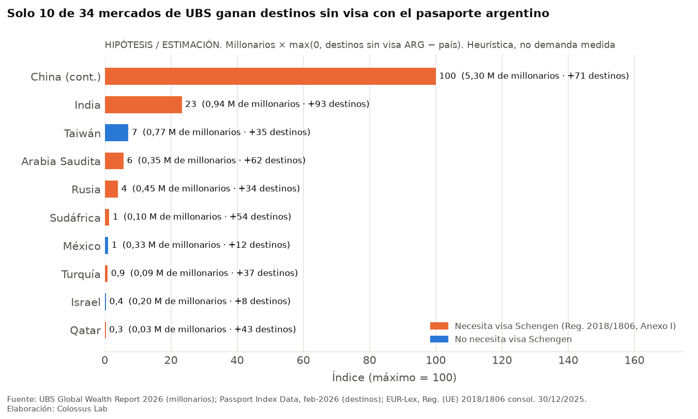

### 1. EE.UU.: cuántos hogares pueden pagar (SCF)

**Fuente y versión.** **DATO:** la página del SCF dice que el relevamiento 2022 es "the most recent survey conducted" (B01). `scfp2025s.zip` devuelve 404: el **SCF 2025 todavía no salió** al 03/10/2026. Por eso se usa el summary extract `scfp2022s.zip` (`rscfp2022.dta`, 22.975 registros = 4.595 hogares × 5 réplicas).

**Tratamiento de las 5 réplicas (implicates).** En el extract, la suma de `wgt` por réplica da 26,26 M y la suma sobre las 22.975 filas da 131,3 M, que es el total de hogares de EE.UU. O sea, **el peso ya viene dividido por 5**. El método fue el siguiente: en cada réplica se usa `wgt × 5`, porque cada réplica representa a toda la población; se estima la cantidad (o la mediana) y se promedian las 5 estimaciones, que es el estimador puntual de Rubin. Para totales y proporciones, esto equivale a sumar `wgt` sobre todas las filas. Se informa el rango entre réplicas como medida de la incertidumbre de imputación. No se calcularon errores muestrales con los pesos replicados (`scf2022rw1s.zip`); queda como limitación.

| Umbral (USD de 2022) | Hogares (promedio de réplicas) | % de hogares | Rango entre réplicas | Mediana del tramo | Aporte 350k / mediana | Aporte 500k / mediana |
|---|---|---|---|---|---|---|
| > 1 M | 23,68 M | 18,0 % | 22,89–25,37 M | USD 2,16 M | 16,2 % | 23,2 % |
| > 5 M | 4,81 M | 3,7 % | 4,57–5,03 M | USD 9,33 M | 3,8 % | 5,4 % |
| > 10 M | 2,13 M | 1,6 % | 2,11–2,16 M | USD 15,17 M | 2,3 % | 3,3 % |
| > 30 M | 0,39 M | 0,3 % | 0,37–0,42 M | USD 48,5 M | 0,7 % | 1,0 % |

Todo lo de la tabla es **ESTIMACIÓN** (B02–B08; detalle en `data/processed/B_scf_umbrales.csv`). Sobre el umbral mismo, el aporte del principal es el 35 % (1 M), el 7 % (5 M) y el 3,5 % (10 M).

**Qué significa "sin esfuerzo".** Es una **HIPÓTESIS** de definición: que el aporte no supere un porcentaje dado del patrimonio (`B_scf_capacidad_pago.csv`):

| Criterio | Principal (USD 350k) | Familia tipo (USD 500k) |
|---|---|---|
| Aporte ≤ 10 % del patrimonio neto | 6,91 M hogares (≥ 3,5 M) | 4,81 M (≥ 5 M) |
| Aporte ≤ 5 % del patrimonio neto | 3,37 M (≥ 7 M) (B09) | 2,13 M (≥ 10 M) (B09) |
| Aporte ≤ 1 % del patrimonio neto | 329 mil (≥ 35 M) (B10) | 185 mil (≥ 50 M) (B10) |
| Liquidez: aporte ≤ 10 % de los activos financieros | 3,48 M (B11) | 2,35 M (B11) |

**Advertencias.** (i) El SCF **excluye por diseño a la lista Forbes 400** y cubre mal la cola extrema. Para esa cola se usa el DFA (sección 2). (ii) Las cifras están en dólares de 2022. Entre 2022 y 2026 la riqueza del top creció (el top 0,1 % pasó del 13,1 % al 15,0 % del total según el DFA), así que en 2026 los conteos probablemente sean mayores (**HIPÓTESIS**). (iii) La unidad es el hogar, mientras que UBS y Altrata cuentan individuos adultos. Aun así, el orden de magnitud coincide: UBS estima 4,12 M de adultos estadounidenses con USD 5–100 M (B23, **DATO**), contra 4,81 M de hogares > USD 5 M en el SCF 2022.

### 2. Cola superior: Distributional Financial Accounts

Los archivos de `dfa.zip` son del 15/09/2026 y el último trimestre es el 2T-2026. Serie completa 1989:T3–2026:T2 en `data/processed/B_dfa_top.csv`; gráfico `B_dfa_top`.

| 2T-2026 | Patrimonio neto | Hogares | Participación | Promedio por hogar | Aporte 350k / promedio |
|---|---|---|---|---|---|
| Top 0,1 % | USD 27,87 billones (B12) | 136.779 (B13) | 15,0 % (B16) | USD 204 M | 0,17 % (B18) |
| Resto del top 1 % (p99–p99,9) | USD 32,45 billones (B14) | 1.214.225 (B14) | 17,5 % | USD 26,7 M | 1,31 % (B18) |
| Top 1 % (suma) | USD 60,31 billones (B15) | 1.351.004 | 32,5 % (B15) | — | — |

**DATO:** el DFA solo publica el corte mínimo de patrimonio en los trimestres con SCF. El último es el 3T-2022: USD 45,8 M para entrar al top 0,1 % y USD 11,0 M para el top 1 % (B17). La participación del top 0,1 % subió del 8,6 % (1989:T3) al 15,0 % (B19, B16).

**DATO, contraste privado (Altrata, PDF de descarga directa sin registro):** 206.880 individuos estadounidenses con ≥ USD 30 M, con un patrimonio conjunto de USD 23,8 billones (B25), sobre 556.850 en el mundo (B26).

### 3. Millonarios por país (UBS Global Wealth Report 2026)

**DATO:** el PDF de la edición 2026 se descarga sin registro. En el HTML de la página **no hay enlace a un databook** con todos los mercados. La tabla "The UBS Millionaire Index" (p. 22) publica el número de millonarios en USD de **34 de los 56 mercados** de la muestra (B22). Quedan fuera, entre otros, Canadá, Dinamarca, Noruega, Austria, Nueva Zelanda, Chile, Colombia y Uruguay. **Argentina no forma parte de la muestra de UBS** (0 menciones en el PDF). EE.UU. tiene 23,627 M (B20) de los ≈ 57,5 M de la muestra (B21); China continental, 5,305 M, e India, 944 mil (B24). Los 34 valores, verificados uno por uno contra el texto del PDF, están en `data/processed/B_ubs_millonarios.csv`.

Altrata (WUWR 2026) sí se pudo usar porque el PDF tiene enlace de descarga directa. Knight Frank (The Wealth Report 2026) **exige un formulario** para dar el enlace de descarga (B27): no se usó.

### 4. Hipótesis del comprador no estadounidense

**Todo este apartado es HIPÓTESIS / ESTIMACIÓN. El índice es una heurística de dónde el pasaporte argentino agregaría movilidad; no mide demanda.**

**Destinos sin visa: por qué no Henley.** **DATO:** los términos de henleyglobal.com prohíben "any robot, spider, scraper, or other automated means to access the website for any purpose" (B28), y el aviso legal prohíbe reproducir contenido sin permiso escrito (B29). Por eso **no se usó la API `api.henleypassportindex.com`**, aunque el probe la había encontrado operativa. Como alternativa abierta se usó **Passport Index Data** (`imorte/passport-index-data`, licencia MIT, actualizado al 17/02/2026, compilado de passportindex.org). Es una matriz de 199 × 199 con el requisito de entrada para cada par. Se cuenta como "sin visa previa" un número de días, `visa free`, `visa on arrival` o `eta`, definición análoga a la de Henley. Con esta fuente, el pasaporte argentino llega a **148 de 198 destinos** (B36, **ESTIMACIÓN**). La cifra no es comparable con el puntaje de Henley, que usa otra metodología y otra fecha. No se pudieron leer los términos de passportindex.org, porque el sitio devuelve 403 anti-bots (ver Fuentes fallidas); la fuente se marca como R con esa advertencia.

**Visa Schengen.** **DATO:** se usa el Reglamento (UE) 2018/1806, versión consolidada al **30/12/2025**, que es la vigente según EUR-Lex al 03/10/2026 (B30). El indicador vale 1 si el país está en el Anexo I. La pertenencia se verifica en el texto consolidado y los países UE/AELC, que no figuran en ningún anexo, valen 0. De los 34 mercados de UBS, están en el Anexo I China, India, Arabia Saudita, Rusia, Sudáfrica, Turquía y Qatar (B31). Argentina está en el Anexo II (B32).

**Variantes calculadas** (`data/processed/B_indice_mercados.csv`; M = millonarios en miles; Δ⁺ = max(0, destinos_ARG − destinos_país); S = 1{Anexo I}):

| Variante | Fórmula |
|---|---|
| I1 (base, la pedida) | M × Δ⁺ × S |
| I2 (sin Schengen) | M × Δ⁺ |
| I3 / I4 (log) | ln(millonarios) × ln(1 + Δ⁺), con y sin S |
| I5 (doble nacionalidad) | M × \|destinos_ARG \ destinos_país\|: lo que suma el pasaporte argentino a quien conserva el propio |
| I6 (cola alta) | adultos con USD 5–100 M (UBS p. 32, 15 mercados) × Δ⁺ × S |

**Ranking (máximo = 100).** Hay **10 mercados con Δ⁺ > 0**, no 15. El resto del ranking de 15 vale cero.

| # | Mercado | Millonarios (miles) | Destinos sin visa | Δ vs ARG (148) | Visa Schengen | I1 | I2 | I4 (log) | I5 |
|---|---|---|---|---|---|---|---|---|---|
| 1 | China (cont.) | 5.305 | 77 | +71 | sí | 100 | 100 | 100 | 100 |
| 2 | India | 944 | 55 | +93 | sí | 23,3 | 23,3 | 94,4 | 21,8 |
| 3 | Arabia Saudita | 348 | 86 | +62 | sí | 5,7 | 5,7 | 79,8 | 5,8 |
| 4 | Rusia | 447 | 114 | +34 | sí | 4,0 | 4,0 | 69,9 | 4,7 |
| 5 | Sudáfrica | 97 | 94 | +54 | sí | 1,4 | 1,4 | 69,5 | 1,4 |
| 6 | Turquía | 93 | 111 | +37 | sí | 0,9 | 0,9 | 62,8 | 1,1 |
| 7 | Qatar | 30 | 105 | +43 | sí | 0,3 | 0,3 | 58,9 | 0,4 |
| 8 | Taiwán | 772 | 113 | +35 | no | 0 | 7,2 | 73,4 | 7,6 |
| 9 | México | 333 | 136 | +12 | no | 0 | 1,1 | 49,3 | 1,0 |
| 10 | Israel | 195 | 140 | +8 | no | 0 | 0,4 | 40,4 | 0,8 |
| — | EE.UU. | 23.627 | 153 | −5 | no | 0 | 0 | 0 | 39,5 |

Lectura (**HIPÓTESIS**). El índice base lo domina China por escala. Con logaritmos, India, Arabia Saudita, Taiwán y Rusia quedan cerca de China. La variante de doble nacionalidad (I5) pone a EE.UU. en segundo lugar solo por la cantidad de millonarios, porque la ganancia real es de 7 destinos (B43). I6 solo da positivo para China, porque los otros 14 mercados con datos de 5–100 M no tienen Δ⁺ > 0 con visa Schengen.

### 5. Contrapesos

**Para quién el pasaporte argentino no agrega nada** (**ESTIMACIÓN**):
- 45 de los otros 198 pasaportes tienen igual o más destinos sin visa que el argentino (B38).
- En 24 de los 34 mercados de UBS, que reúnen 44,7 M de 53,3 M de millonarios (84 %), la brecha es ≤ 0 (B39). Son EE.UU., toda la UE, Suiza, el Reino Unido, Japón, Corea, Australia, Singapur, Hong Kong, Emiratos y Brasil.
- Al estadounidense, que es el mercado más rico, el pasaporte argentino le suma 7 destinos: China (30 días), Brasil, Rusia, Irán, Venezuela, Bielorrusia y Uzbekistán (B43). No le da nada en Europa.
- **DATO:** el pasaporte argentino **requiere visa para EE.UU. y Canadá** (B37). Para un comprador chino o indio, el acceso a EE.UU. no cambia.

**Evidencia sobre el motivo de compra (movilidad u otros).**
- **DATO:** la evidencia oficial más directa es la del caso Vanuatu. La UE constató que su programa permitía a nacionales de países con visa "obtaining visa-free access to the Union" (B34). Constató también que la mayoría de los solicitantes exitosos de 2022–2023 venía de países con visa; en 2023, China 519 y Rusia 237 (B35). Ese patrón de origen es **compatible** con el motivo de movilidad, pero **no prueba** el motivo: nadie relevó las razones de los compradores.
- **HIPÓTESIS (sin dato):** no se encontró una fuente primaria ni privada con metodología pública que releve los motivos de los compradores de CBI, como movilidad, plan B político, impuestos, educación o residencia. Henley, que publica encuestas sobre esto, quedó excluido por sus términos. Por lo tanto, que los compradores elijan por movilidad sigue siendo una **HIPÓTESIS no verificada**. Para el comprador estadounidense, el motivo de movilidad prácticamente no aplica (B43). Si existe demanda estadounidense, tendría que explicarse por otros motivos (plan B, residencia, afinidad).
- **DATO, riesgo regulatorio que contradice la tesis:** desde el Reg. (UE) 2025/2441, el art. 8 del 2018/1806 incluye como causal de suspensión de la exención de visa "the operation, by a third country listed in Annex II, of an investor citizenship scheme … without that person having any genuine link to that third country" (B33). El DNU 366/2025 permite naturalizar "cualquiera sea el tiempo de su residencia" (A09). **HIPÓTESIS:** precisamente el activo que el índice pone en valor, el acceso Schengen para nacionales de países del Anexo I, es lo que podría poner en riesgo la exención de visa de **todos** los argentinos.
- **HIPÓTESIS, no verificado:** China e India restringen la doble nacionalidad. Si es así, el comprador de los dos mercados que encabezan el índice perdería (de derecho) su nacionalidad de origen. No se pudo verificar en fuente primaria: npc.gov.cn redirige a la portada, e indiacode.nic.in y mha.gov.in devuelven 403. Hay que verificarlo antes de usar el ranking.
- **HIPÓTESIS:** para compradores rusos, los controles de SIDE/UIF que prevé el Decreto 524/2025 (A15) y el entorno de sanciones pueden reducir la demanda efectiva.

### Fuentes

| Fuente | Tipo | URL |
|---|---|---|
| Federal Reserve, SCF (página índice) | P | https://www.federalreserve.gov/econres/scfindex.htm |
| Federal Reserve, SCF 2022 summary extract (Stata) | P | https://www.federalreserve.gov/econres/files/scfp2022s.zip |
| Federal Reserve, Distributional Financial Accounts | P | https://www.federalreserve.gov/releases/z1/dataviz/download/zips/dfa.zip |
| UBS, Global Wealth Report 2026 (PDF) | R | https://www.ubs.com/global/en/wealthmanagement/insights/global-wealth-report.html (enlace "gwr-2026-digital.pdf") |
| Altrata, World Ultra Wealth Report 2026 (PDF) | R | https://altrata.com/wp-content/uploads/2026/06/Altrata_World-Ultra-Wealth-Report-2026_FINAL.pdf |
| Knight Frank, página de The Wealth Report (solo para documentar el formulario) | R | https://www.knightfrank.com/wealthreport |
| Henley & Partners, Terms of Use y Disclaimer (solo para documentar la exclusión) | R | https://www.henleyglobal.com/terms-of-use · https://www.henleyglobal.com/disclaimer |
| Passport Index Data (MIT, 17/02/2026; datos de passportindex.org) | R | https://github.com/imorte/passport-index-data (`passport-index-tidy-iso3.csv`, README, LICENSE) |
| EUR-Lex, Reglamento (UE) 2018/1806, ficha y versión consolidada 30/12/2025 | P | https://eur-lex.europa.eu/legal-content/EN/ALL/?uri=CELEX:32018R1806 · https://eur-lex.europa.eu/legal-content/EN/TXT/HTML/?uri=CELEX:02018R1806-20251230 |
| Reglamento (UE) 2025/11 (Vanuatu), Oficina de Publicaciones (Cellar) | P | https://publications.europa.eu/resource/celex/32025R0011 |

### Fuentes fallidas

| Fecha | Fuente | URL | Error | Causa | Acción |
|---|---|---|---|---|---|
| 2026-10-03 | Fed SCF 2025 | https://www.federalreserve.gov/econres/files/scfp2025s.zip | HTTP 404 | Todavía no publicado (la página índice dice que 2022 es el último) | Se usa el SCF 2022; re-correr cuando salga el 2025 |
| 2026-10-03 | Henley Passport Index API | https://api.henleypassportindex.com/api/v3/countries | — (responde 200) | Los términos prohíben el acceso automatizado y la reproducción (B28, B29) | No se usa; alternativa Passport Index Data (MIT). **Afecta también al Módulo D**, que planeaba usar Henley |
| 2026-10-03 | passportindex.org (términos de la fuente original del dataset) | https://www.passportindex.org/ | HTTP 403 ("Just a moment…") | Protección anti-bots (Cloudflare) | Se intentó Wayback (captura 21/09/2026 de la portada): la conexión a web.archive.org se cortó. Se usa el dataset MIT con advertencia (tipo R) |
| 2026-10-03 | Knight Frank, The Wealth Report 2026 | https://www.knightfrank.com/wealthreport | Formulario de registro | El informe se entrega tras completar un formulario (B27) | No se usa (regla de no scrapear detrás de un registro) |
| 2026-10-03 | UBS, databook por país | página GWR 2026 | No hay databook enlazado | UBS solo publica 34 de 56 mercados en el PDF | Se usa la tabla de la p. 22; los otros 22 mercados quedan fuera del índice |
| 2026-10-03 | EUR-Lex, Reg. (UE) 2025/11 | https://eur-lex.europa.eu/legal-content/EN/TXT/HTML/?uri=CELEX:32025R0011 | HTTP 202 con cuerpo vacío | Desafío anti-bots (AWS WAF, `x-amzn-waf-action: challenge`) | Mismo texto oficial vía la Oficina de Publicaciones (Cellar) |
| 2026-10-03 | Ley de Nacionalidad de China (NPC) | http://www.npc.gov.cn/zgrdw/englishnpc/Law/2007-12/12/content_1383852.htm | Redirige a la portada | URL obsoleta | Restricción de doble nacionalidad marcada "no verificada" |
| 2026-10-03 | Citizenship Act 1955 (India) | indiacode.nic.in / mha.gov.in | HTTP 403 | Protección anti-bots | Idem: "no verificado" |

### Limitaciones

- El SCF 2022 está en dólares de 2022 y tiene cuatro años de antigüedad; no se calcularon errores muestrales (pesos replicados) y excluye a los Forbes 400. Hogares ≠ individuos.
- "Sin esfuerzo" es una definición arbitraria (≤ 10 %, 5 % o 1 % del patrimonio). El patrimonio neto incluye activos ilíquidos; la variante con activos financieros es una aproximación a la liquidez.
- El índice usa solo los 34 mercados con número de millonarios publicado. Excluye a Argentina y a vecinos como Chile, Colombia y Uruguay, y a Canadá, entre otros. No pondera la calidad de los destinos: no es lo mismo Schengen que un país pequeño.
- La matriz de visados es una compilación privada (passportindex.org vía un dataset MIT) de febrero de 2026, sin verificación contra cada país de destino. No es comparable con el puntaje de Henley. La cobertura Schengen sí está verificada contra la fuente primaria.
- No hay datos sobre los motivos de los compradores de CBI. La relación entre movilidad y demanda es una **HIPÓTESIS**.
- La versión consolidada del 2018/1806 es al 30/12/2025. Si hubo modificaciones en 2026, EUR-Lex todavía no las consolidó.

## Módulo C — Benchmark de programas de ciudadanía por inversión

**Resumen (5 líneas)**
1. **DATO:** En el Caribe Oriental la donación mínima vigente está entre USD 230.000 y 250.000 y cubre a una familia de hasta 4 personas. Antigua cobra USD 230.000 (NDF), Granada 235.000 (NTF), Santa Lucía 240.000 (NEF) y St Kitts 250.000 (SISC), todas vigentes desde julio–agosto de 2024. Nauru cobra USD 105.000, rebajados a 90.000 durante 2026. Turquía no tiene donación: pide un inmueble de USD 400.000 o una inversión, depósito o bono de USD 500.000 (C01–C17).
2. **ESTIMACIÓN:** el aporte argentino (USD 350.000) cuesta entre 1,40 y 1,52 veces la donación caribeña, y la familia tipo (USD 500.000) entre 2,0 y 2,2 veces. Ningún programa del benchmark con monto verificado pide más que el bono argentino (USD 800.000). A cambio, el pasaporte argentino llega a más destinos sin visa que todos salvo Malta: 148, contra 123–136 en el Caribe y 111 en Turquía (C80–C83, A01–A05, B36).
3. **ESTIMACIÓN:** el CBI llegó a recaudar el 38% del PBI en Dominica (año fiscal 2022) y el 26% en St Kitts (2022). Los cinco programas caribeños juntos recaudaron unos USD 2.460 M de ingreso fiscal en 2020–2024, unos USD 490 M por año. Eso equivale a ≈1.400 aportes argentinos por año (C84–C90).
4. **DATO — contrapeso:** la UE suspendió y después eliminó la exención de visado Schengen de Vanuatu por su CBI (2022 → 2025). En 2025 hizo del CBI sin vínculo genuino una causal general de suspensión (Reg. 2025/2441, que cita lavado de dinero y corrupción). El TJUE declaró ilegal el programa maltés (C-181/23), y Malta lo derogó. EE.UU. restringió la entrada de nacionales de Antigua y Dominica por su "CBI sin residencia" (C50–C57, C18–C19).
5. **DATO + HIPÓTESIS — dependencia fiscal:** el ingreso CBI de St Kitts cayó de 22% a 8% del PBI en un año tras endurecer controles, y el de Vanuatu de ~14% a 5,4% tras perder la exención Schengen. El FMI vincula la dependencia del CBI a la menor presión tributaria de la región (C21, C22, C26). **HIPÓTESIS:** un programa argentino quedaría expuesto a los mismos instrumentos (el pasaporte argentino figura en el Anexo II de la UE, B32–B33), con el agravante de que lo que está en juego es una exención de visado más valiosa.

---

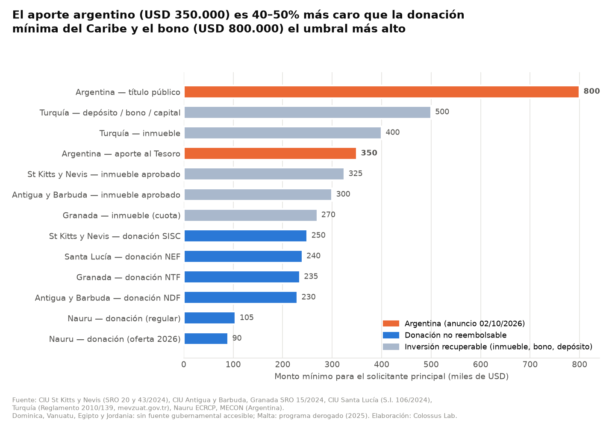
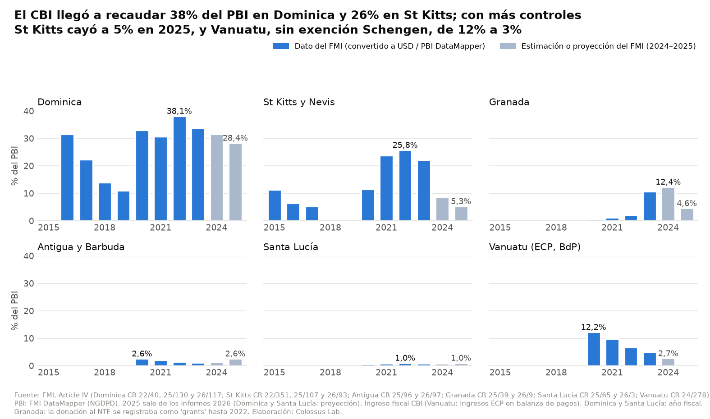

### 1. Montos mínimos vigentes (solo fuente gubernamental)

Archivo: `data/processed/C_montos_minimos.csv`. Gráfico: `outputs/charts/C_montos_minimos.{png,svg}`.

| País | Vía | Tipo | Mínimo principal (USD) | Familia tipo (USD) | Vigencia | Claim |
|---|---|---|---:|---:|---|---|
| **Argentina** | Aporte al Tesoro | Donación | **350.000** | **500.000** | Anuncio 02/10/2026 (sin norma, A17) | A01, A05 |
| **Argentina** | Título público | Bono | **800.000** | — | Anuncio 02/10/2026 | A02 |
| St Kitts y Nevis | SISC | Donación a fondo | 250.000 | 250.000 (hasta 4 personas) | SRO 20/2024 (8/7/2024) | C01, C02 |
| St Kitts y Nevis | Desarrollo inmobiliario aprobado | Inmobiliario | 325.000 | — | SRO 43/2024 (25/10/2024) | C03 |
| Antigua y Barbuda | NDF | Donación a fondo | 230.000 | 230.000 (hasta 4; tasas aparte) | S.I. 2024 No. 50 (oferta previa vencida 31/7/2024) | C04, C05* |
| Antigua y Barbuda | Inmueble aprobado | Inmobiliario | 300.000 | — | Web oficial | C06 |
| Granada | NTF | Donación a fondo | 235.000 | 235.000 (principal + 3) | SRO 15/2024, vigente 1/7/2024 | C07 |
| Granada | Unidad en proyecto aprobado (cuota) / proyecto | Inmobiliario | 270.000 / 350.000 | — | SRO 15/2024 | C09 |
| Santa Lucía | NEF | Donación a fondo | 240.000 | 240.000 (principal + 3) | S.I. 106/2024, vigente 1/7/2024 | C10, C11 |
| Turquía | Inmueble (3 años sin vender) | Inmobiliario | 400.000 | n/p | Reglamento 2010/139 art. 20 (mod. 2022) | C14 |
| Turquía | Capital fijo / depósito / bonos del Estado | Inversión / bono | 500.000 | n/p | Ídem | C15 |
| Nauru | ECRCP (oferta 2026) | Donación a fondo | 90.000 (regular 105.000) | n/p | Oferta desde 3/2/2026 hasta 31/12/2026 | C16, C17 |
| Dominica | EDF | Donación | **no verificado** | — | — | (piso regional MoA 2024: USD 200.000, C20) |
| Vanuatu | DSP | Donación | **no verificado** | — | — | — |
| Egipto | Decreto PM 876/2023 | Varios | **no verificado** | — | — | — |
| Jordania | Criterios del Consejo de Ministros | Depósito / bono / inversión | **no verificado** | — | — | — |
| Malta | MEIN | — | **derogado** | — | Act XXI 2025 (24/7/2025) | C18, C19, C56 |

n/p = la fuente no publica el monto familiar. *C05 es una **lectura visual** de un PDF escaneado sin capa de texto (ver Limitaciones).

- **DATO:** en Santa Lucía, el S.I. 57/2026 (23/3/2026) limita a 1.500 por año las solicitudes aprobadas (C27). Es el primer cupo explícito del Caribe.
- **DATO:** St Kitts llevó en julio de 2023 la opción en efectivo de USD 125.000 a 250.000 (C24). Según el FMI, los cinco países firmaron en marzo de 2024 un Memorando de Acuerdo con un piso de USD 200.000 (C20).
- **Malta (tras el TJUE):** la sentencia C-181/23 (29/4/2025) declaró que el programa de "naturalización por servicios excepcionales por inversión directa" incumplía el art. 20 TFUE y el art. 4.3 TUE (C56). La Act XXI de 2025 eliminó la figura "individual investor programme" y reemplazó el art. 10(9) por una naturalización "por mérito" (C18, C19). **No hay hoy monto de inversión vigente en Malta.**

### 2. Recaudación CBI en USD y % del PBI (FMI)

Archivo: `data/processed/C_recaudacion_cbi.csv`. Gráfico: `outputs/charts/C_recaudacion_pbi.{png,svg}`.

**Método:**
- **Extracción.** Cada fila se extrae con pdfplumber de la tabla del Article IV, en la página indicada. La cita literal de la fila (rótulo + valores) queda en el ledger.
- **Conversión a USD (ESTIMACIÓN).** Se usa la fila en USD cuando el FMI la publica (Dominica, 2020–2024). Si no, se convierte desde EC$ a la paridad fija de 2,70 (C42), o se multiplica el % del PBI por el PBI en EC$ de la misma tabla.
- **% del PBI (ESTIMACIÓN).** Es USD / PBI nominal de la API DataMapper (NGDPD, C70–C75). El % que publica el FMI va al lado como DATO para validar: las diferencias son menores a 2 puntos.
- **Dos conceptos.** "Ingreso fiscal" (lo que entra al presupuesto) y "flujo BdP" (entradas totales CBI en balanza de pagos, incluido lo inmobiliario). Para Vanuatu solo hay el segundo.

| País | Pico (% PBI, DataMapper) | Último año (2024, est. FMI) | Acumulado fiscal 2020–2024 (USD M) | Claims |
|---|---|---|---:|---|
| Dominica (año fiscal jul–jun) | 38,1% (FY2022) | 31,5% | ≈1.007 | C30–C35, C84 |
| St Kitts y Nevis | 25,8% (2022) | 8,6% | ≈869 | C36–C39, C85 |
| Granada (ingreso fiscal) | 12,4% (2024) | 12,4% | ≈354 | C43–C45, C87 |
| Granada (flujo BdP) | 32,1% (2024) | 32,1% | — | C44 |
| Antigua y Barbuda | 2,6% (2020) | 1,3% | ≈146 | C40–C41, C86 |
| Santa Lucía (año fiscal abr–mar) | 1,0% (FY2022) | 0,8% | ≈86 | C46–C47, C88 |
| Vanuatu (ECP, BdP) | 12,2% (2020) | 2,7% | ≈411 | C48–C49, C89 |

- **ESTIMACIÓN:** los cinco programas caribeños suman ≈ USD 2.460 M de ingreso fiscal en 2020–2024 (≈ USD 490 M por año), unos 1.400 aportes argentinos por año (C90). Esto sirve para dimensionar los escenarios del Módulo G: el techo de G (3.000 solicitantes por año) duplica lo que recauda hoy todo el Caribe.
- **DATO:** el FMI proyecta que el ingreso CBI regional baje de 7% del PBI de la ECCU (2024) a 4% (2029) (C23).
- **Comparabilidad:** en Santa Lucía y Antigua el ingreso que llega al presupuesto es chico (≈1–2,6% del PBI) porque el grueso va a fondos fuera del presupuesto (NEF) o a inversión inmobiliaria. En Granada, hasta 2022 la donación al NTF se registraba como "grants" y no como ingreso CBI (nota 1/ de la tabla del FMI): la serie fiscal subestima los años previos a 2023, y el flujo BdP es la medida comparable.

### 3. Casos regulatorios (fuente primaria)

Archivo: `data/processed/C_casos_regulatorios.csv`.

| Fecha | Caso | Hecho (DATO) | Claim |
|---|---|---|---|
| 03/03/2022 | Vanuatu | Decisión (UE) 2022/366: suspensión parcial del acuerdo de exención de visados (pasaportes emitidos desde el 25/5/2015) | C50 |
| 31/05/2024 | Vanuatu | Reg. Delegado (UE) 2024/2059: prorroga la suspensión total del 4/8/2024 al 3/2/2025. El CBI sigue sin exigir residencia | C51 |
| 19/12/2024 (DOUE 14/1/2025) | Vanuatu | Reg. (UE) 2025/11: Vanuatu pasa al Anexo I (visa obligatoria). En 2023 la mayoría de los solicitantes venía de China (519) y Rusia (237) | C52, C53 (y B34–B35) |
| 26/11/2025 (DOUE 10/12/2025) | UE, mecanismo de suspensión | Reg. (UE) 2025/2441: nueva causal (e), operar un CBI "sin vínculo genuino". El considerando 7 cita lavado de dinero y corrupción | C54, C55 (y B33) |
| 29/04/2025 | Malta | TJUE C-181/23, parte resolutiva: Malta incumplió el art. 20 TFUE y el art. 4.3 TUE; condena en costas | C56 |
| 24/07/2025 | Malta | Act XXI 2025: se elimina el "individual investor programme" y se pasa a la naturalización por mérito | C18, C19 |
| 16/12/2025 (FR 19/12/2025) | EE.UU. → Antigua y Dominica | Proclamación presidencial: suspende visas de inmigrante y B, F, M y J para ambos países, porque "has historically had CBI without residency" | C57, C58 |
| 06/10/2023 | Portugal | Lei 56/2023, art. 42: no admite nuevos pedidos de autorización de residencia para inversión de las subalíneas I, III y IV (incluida la inmobiliaria) | C60 |
| 02/01/2025 (BOE 3/1/2025) | España | LO 1/2025, DF 21.ª: **deja sin contenido los arts. 63–67 de la Ley 14/2013**. Elimina toda la residencia para inversores, no solo la inmobiliaria. Vigencia general a los 3 meses | C59 |
| 17/02/2022 | Reino Unido | Cierre de la ruta Tier 1 (Investor) "over security concerns". Daba "opportunities for corrupt elites" | C61 |
| 15/02/2023 | Irlanda | Cierre del Immigrant Investor Programme, que había aprobado ≈ €1.252 M | C62 |

**Presión de la UE en 2026 (no verificado en fuente primaria):** según la prensa, la Comisión pidió por carta (25/6/2026) a los cinco países caribeños eliminar su CBI hasta el 1/6/2028, bajo amenaza de aplicarles el Reg. 2025/2441. La carta no está publicada, y la CIU de Antigua no publicó ninguna declaración sobre el tema en cip.gov.ag (última actualización relevante: 19/12/2025, sobre EE.UU.). Queda como **S**, solo para fechar.

### 4. Posicionamiento de Argentina

Archivo: `data/processed/C_posicionamiento.csv`.

| País | Donación mínima (USD) | Familia tipo (USD) | Destinos sin visa (Módulo B) | Aporte AR / donación | USD por destino sin visa |
|---|---:|---:|---:|---:|---:|
| Argentina | 350.000 | 500.000 | 148 | 1,00 | 2.365 |
| St Kitts y Nevis | 250.000 | 250.000 | 136 | 1,40 | 1.838 |
| Santa Lucía | 240.000 | 240.000 | 125 | 1,46 | 1.920 |
| Granada | 235.000 | 235.000 | 128 | 1,49 | 1.836 |
| Antigua y Barbuda | 230.000 | 230.000 | 132 | 1,52 | 1.742 |
| Nauru | 90.000 | — | 73 | 3,89 | 1.233 |
| Turquía | (inmueble 400.000) | — | 111 | — | — |
| Malta (derogado) | — | — | 159 | — | — |
| Dominica / Vanuatu / Jordania / Egipto | no verif. | — | 123 / 80 / 49 / 48 | — | — |

- **ESTIMACIÓN:** Argentina es el programa **más caro** del benchmark verificado en donación (+40–52%) y en familia tipo (≈2×) (C80, C81). En cambio, ofrece el **mejor pasaporte** del grupo vigente: 148 destinos frente a 136 del mejor caribeño. Aun así, por destino sin visa resulta ≈25–35% más caro que el Caribe (C82, C83).
- **HIPÓTESIS:** el diferencial de precio solo se justifica si el comprador valora atributos que el conteo de destinos no captura (un país grande, residencia efectiva posible, Mercosur). Esa tesis la evalúa el Módulo B. Por monto, Argentina compite con las vías inmobiliarias de Turquía y St Kitts, no con las donaciones caribeñas.

### 5. Contrapesos (riesgos para un programa nuevo)

1. **Pérdida de exenciones de visado (DATO).** El caso Vanuatu muestra la secuencia completa: suspensión parcial (2022), suspensión total (2023–2025) y paso al Anexo I (2025) (C50–C52). Desde el 30/12/2025, el Reg. 2025/2441 permite suspender a **cualquier** país del Anexo II que opere un CBI sin vínculo genuino (C54), y Argentina está en el Anexo II (B32, B33). **HIPÓTESIS:** el esquema anunciado (sin requisito de residencia, A09) encaja en la definición de la causal (e).
2. **Objeciones de la UE y EE.UU. (DATO).** El TJUE considera "comercialización de la ciudadanía" la naturalización a cambio de pagos predeterminados (C56). EE.UU. restringió visas a Antigua y Dominica citando el CBI sin residencia (C57). Argentina es candidata al Visa Waiver Program (Módulo D), y esa candidatura es el activo más expuesto.
3. **Reputación y lavado (DATO).** El Reg. 2025/2441 cita lavado de dinero y corrupción (C55). El FMI marca al ECP de Vanuatu como "an important risk" en su evaluación de riesgo ALA/CFT (C25), y el Reino Unido cerró el Tier 1 por "corrupt elites" (C61).
4. **Dependencia y volatilidad fiscal (DATO + ESTIMACIÓN).** St Kitts pasó de 22% a 8% del PBI en un año (C21). Vanuatu pasó de ~14% a 5,4% en tres años (C26). Según el FMI, la dependencia del CBI frenó la recaudación tributaria (C22), y el FMI proyecta que el CBI regional siga bajando (C23).
5. **Tendencia de cierre (DATO).** Entre 2022 y 2025 cerraron sus visas o ciudadanías por inversión el Reino Unido, Irlanda, Portugal (vía inmobiliaria), España (todas las vías) y Malta (C18, C59–C62). El programa argentino se lanza a contramano de esa tendencia.

### Fuentes

| Fuente | Tipo | URL |
|---|---|---|
| St Kitts y Nevis CIU: SISC, Real Estate, Government Notices; SRO 20/2024 y 43/2024 | P | https://ciu.gov.kn/ |
| Antigua y Barbuda CIU: NDF, Real Estate, S.I. 2024 No. 50, declaración del 19/12/2025 | P | https://cip.gov.ag/ |
| Granada, SRO 15/2024 (Laws of Grenada) | P | https://www.laws.gov.gd/index.php/s-r-o/1527-sr-o-15-of-2024-grenada-citizenship-by-investment-amendment-no-2-regulations/download |
| Santa Lucía CIU: web; S.I. 106/2024 y 57/2026 | P | https://www.cipsaintlucia.com/citizenship-legislation |
| Turquía, Reglamento 2010/139 (texto consolidado) | P | https://www.mevzuat.gov.tr/MevzuatMetin/21.5.2010139.pdf |
| Nauru ECRCP: Contribution y Factsheet 03/2025 | P | https://www.ecrcp.gov.nr/contribution |
| Malta, Act XXI of 2025 | P | https://legislation.mt/eli/act/2025/21/eng/pdf |
| FMI Article IV: Dominica CR 25/130 y 22/40; St Kitts CR 25/107 y 22/351; Antigua CR 25/96; Granada CR 25/39; Santa Lucía CR 25/65; Vanuatu CR 24/278 | P | https://www.imf.org/-/media/Files/Publications/CR/… (enlaces directos en `src/03_benchmark.py`) |
| FMI DataMapper, NGDPD | P | https://www.imf.org/external/datamapper/api/v1/NGDPD/DMA/KNA/ATG/GRD/LCA/VUT |
| UE: Decisión 2022/366; Reg. Delegado 2024/2059; Reg. 2025/11; Reg. 2025/2441 (Oficina de Publicaciones) | P | https://publications.europa.eu/resource/celex/32025R2441 (y CELEX 32022D0366, 32024R2059, 32025R0011) |
| TJUE C-181/23, sentencia de 29/04/2025 (CELEX 62023CJ0181, ES) | P | https://publications.europa.eu/resource/celex/62023CJ0181 |
| EE.UU., Federal Register 2025-23570 (proclamación del 16/12/2025) | P | https://www.govinfo.gov/content/pkg/FR-2025-12-19/pdf/2025-23570.pdf |
| España, BOE-A-2025-76 (LO 1/2025) | P | https://www.boe.es/diario_boe/txt.php?id=BOE-A-2025-76 |
| Portugal, Lei 56/2023 (texto consolidado, Portal das Finanças) | P | https://info.portaldasfinancas.gov.pt/pt/informacao_fiscal/legislacao/diplomas_legislativos/Documents/Lei_56_2023.pdf |
| Reino Unido, Home Office (gov.uk) | P | https://www.gov.uk/government/news/tier-1-investor-visa-route-closes-over-security-concerns |
| Irlanda, Immigration Service Delivery | P | https://www.irishimmigration.ie/minister-harris-announces-closure-of-the-immigrant-investor-programme/ |
| Destinos sin visa (Passport Index Data, vía Módulo B) | R | data/processed/B_pasaportes_destinos.csv |
| Prensa (fechado de la carta de la Comisión de junio de 2026; montos de Egipto, Jordania y Vanuatu) | S | No se usa como origen de cifras |

### Fuentes fallidas

Detalle completo en `data/processed/C_fuentes_fallidas.csv`.

| Fecha | Fuente | URL | Error | Causa | Acción |
|---|---|---|---|---|---|
| 2026-10-03 | Dominica CBIU | https://www.cbiu.gov.dm/investment-options/ | 202 → /.well-known/sgcaptcha/ | Captcha anti-bots (también en los PDF) | Wayback falló (ver abajo); Dominica queda "no verificado" |
| 2026-10-03 | Dominica, leyes (S.R.O. 1 y 8/2024) | https://www.dominica.gov.dm/laws/2024/… | 502 / connection reset | Host caído | Solo el piso regional (C20) como contexto |
| 2026-10-03 | Wayback Machine | https://web.archive.org/web/20260916071416id_/https://www.cbiu.gov.dm/investment-options/ | Connection reset | El túnel a web.archive.org se corta (archive.org/wayback/available sí responde) | Captura identificada, no descargada |
| 2026-10-03 | Granada imm.gov.gd | https://www.imm.gov.gd/ | 502 | Host caído | Se usó laws.gov.gd |
| 2026-10-03 | Granada IMA (imagrenada.gd) | https://imagrenada.gd/wp-content/uploads/2024/07/S.R.O.-15-of-2024-… | 202 + sgcaptcha | Anti-bots | Se usó laws.gov.gd |
| 2026-10-03 | Vanuatu (PacLII / Citizenship Office) | https://www.paclii.org/vu/legis/num_reg/ ; https://citizenship.gov.vu/ | 403 / 502 | Anti-bots / host caído | Monto no verificado |
| 2026-10-03 | Jordania (JIC / MOIN) | https://www.jic.gov.jo/en/ | Connection reset; MOIN redirige a la portada árabe | Host inaccesible | Monto no verificado |
| 2026-10-03 | Egipto (decreto 876/2023) | https://www.state.gov/reports/2024-investment-climate-statements/egypt/ | 403; decreto no publicado en abierto | Anti-bots | Monto no verificado |
| 2026-10-03 | FMI Article IV 2026 (St Kitts CR 26/93, Dominica CR 26/117) | https://www.imf.org/en/publications/cr/issues/2026/05/07/st-575691 | 403; eLibrary 202 vacío | Anti-bots; el PDF no sigue el patrón -/media | Serie cortada en 2024 (estimación) |
| 2026-10-03 | FMI Antigua CR 23/184 | https://www.imf.org/-/media/Files/Publications/CR/2023/English/1ATGEA2023001.ashx | Tablas como imagen | Sin capa de texto | Antigua solo 2020–2024 |
| 2026-10-03 | EUR-Lex | https://eur-lex.europa.eu/legal-content/EN/TXT/?uri=CELEX:32025R2441 | 202, cuerpo vacío | WAF | Mismo texto vía Oficina de Publicaciones |
| 2026-10-03 | Curia | https://curia.europa.eu/juris/liste.jsf?num=C-181/23&language=en | Redirige a infocuria (JS) | Contenido en JavaScript | Sentencia vía Oficina de Publicaciones |
| 2026-10-03 | Diário da República (PT) | https://diariodarepublica.pt/dr/detalhe/lei/56-2023-221792115 | 200, 2 KB (JS) | Contenido en JavaScript | Texto consolidado de la AT |
| 2026-10-03 | Resmî Gazete 13/05/2022 | https://www.resmigazete.gov.tr/eskiler/2022/05/20220513-20.pdf | PDF sin texto | Escaneo | Texto consolidado de mevzuat.gov.tr |

### Limitaciones

- **C05 (Antigua, S.I. 2024 No. 50)** es un PDF escaneado sin capa de texto (no hay OCR en el entorno). La cita es una **lectura visual** de las pp. 7 y 9, entre corchetes; `quote()` no puede verificarla, y la auditoría automática la da por "OK" con 0 citas. El monto de USD 230.000 sí está verificado de forma literal en la web oficial (C04).
- **Dominica, Vanuatu, Egipto y Jordania** quedan sin monto: no se reemplazaron con cifras de prensa ni de agentes. La regla de fuente gubernamental tiene una excepción parcial: para Nauru la fuente es el sitio oficial del programa (ecrcp.gov.nr, dominio del gobierno).
- **Serie de recaudación:** los Article IV 2026 no fueron accesibles, así que 2024 es una estimación del FMI y faltan 2025–2026. St Kitts no tiene datos de 2018–2019. Antigua y Santa Lucía arrancan en 2020. Las cifras en USD salvo Dominica 2020–2024 son ESTIMACIÓN (paridad EC$ 2,70). Dominica y Santa Lucía usan año fiscal y se dividen por el PBI calendario del año de inicio. En Granada hay un quiebre contable en 2023 (NTF registrado como "grants" antes). El PBI de St Kitts 2015–2017 viene de un Article IV anterior a la revisión de 2021 de sus cuentas nacionales.
- **Turquía:** el texto consolidado atribuye los montos de 400.000 y 500.000 al C.K. 5072 (RG 31711, 6/1/2022), con un cambio de redacción de la letra b) por el C.K. 5554 (RG 31834, 13/5/2022). Turquía no publica un monto para la familia.
- **Nauru:** el monto de USD 90.000 es una oferta por tiempo limitado (solicitudes hasta el 31/12/2026). El regular es USD 105.000.
- **Passport Index Data** es de tipo R (vía Módulo B): un conteo propio de destinos, no el Henley.
- **Montos argentinos:** todavía no tienen norma publicada (A17). El ratio de precios supone que el anuncio se mantiene.

### Archivos
- `src/03_benchmark.py` genera `data/processed/C_montos_minimos.csv`, `C_recaudacion_cbi.csv`, `C_casos_regulatorios.csv`, `C_posicionamiento.csv`, `C_fuentes_fallidas.csv`, `outputs/charts/C_montos_minimos.{png,svg}`, `outputs/charts/C_recaudacion_pbi.{png,svg}` y `docs/claims/claims_C.csv` (74 afirmaciones).

## Módulo D — Pasaporte argentino y Visa Waiver Program de EE.UU.

**Resumen (5 líneas)**
1. **ESTIMACIÓN (fuente R):** con datos de Passport Index Data (febrero de 2026; no es el Henley), el pasaporte argentino entra sin visa previa a 148 de 198 destinos, puesto 45 de 199. Empata con Chile (148), queda apenas detrás de Brasil (149) y por delante de Uruguay (137) y México (136). Lo que separa a Argentina de Chile es EE.UU. (visa frente a ESTA) y Canadá (visa o eTA condicional frente a eTA) (D60–D68, D41–D43). El Henley no se usó porque sus términos de uso prohíben el acceso automatizado (D01–D02).
2. **DATO:** la ley (8 U.S.C. §1187(c)) dice que el DHS "**may** designate" (puede designar) a un país. Para eso exige una tasa de rechazo de visas de visitante del año fiscal anterior **menor al 3,0%**, o bien un promedio de dos años **menor al 2,0%** con cada año **menor al 2,5%**. Exige además pasaporte electrónico, acuerdo de intercambio de información sobre amenazas, reporte de pasaportes perdidos en 24 h, repatriación en 3 semanas y una evaluación de seguridad del DHS. El 3% es necesario, pero no suficiente (D03–D12, D14–D16).
3. **DATO:** Chile fue nominado por el Departamento de Estado el 03/06/2013, designado el 28/02/2014 y opera en el VWP desde el 31/03/2014; es el único país latinoamericano entre los 42 del programa. Argentina fue miembro entre 1996 y 2002. La sacaron por la crisis y por el uso del programa para quedarse a trabajar; en aquella baja EE.UU. señaló que el proceso para obtener los documentos base del pasaporte "lacks integrity" (carece de integridad) (D18–D19, D23–D27, D44).
4. **DATO:** el 28/07/2025, DHS y el Gobierno argentino firmaron una **declaración de intención** para el reingreso de Argentina al VWP. DHS habla de cumplir los criterios "in the coming years" (en los próximos años). Según DHS/CBP, el overstay de visitantes argentinos fue de 0,81% en FY2024, contra 2,32% de Chile, que ya está en el programa (D28–D33). **No se pudo verificar en fuente primaria la tasa de rechazo de Argentina en FY2025**: web.archive.org cortó todas las conexiones, aunque las 20 capturas FY2006–FY2025 existen y están registradas.
5. **HIPÓTESIS:** la CBI puede jugar en contra de la candidatura. El DHS evalúa la integridad de la identidad de quienes viajan con el pasaporte, y hay antecedentes concretos: FinCEN 2014 sobre St. Kitts (rescindido en 2026), la visa que el Reino Unido impuso a Dominica y Vanuatu en 2023, la UE con Vanuatu (B34) y la observación de 2002 sobre los documentos argentinos. Rumania muestra que una designación ya otorgada puede revocarse por discrecionalidad (D21–D22, D27, D70–D73).

---

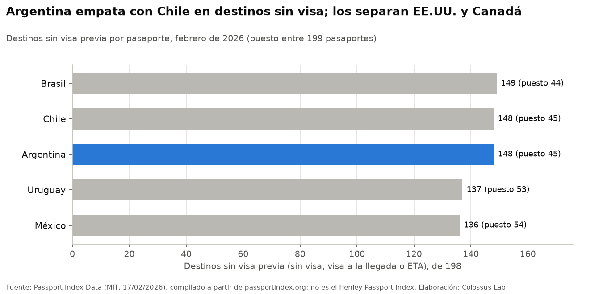
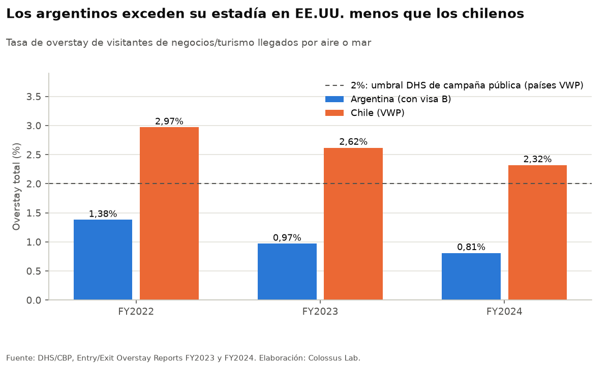

### 1. Valor del pasaporte argentino (pregunta 1)

**Henley Passport Index: no se usó.** Los *Terms of Use* de henleyglobal.com (copia del Módulo B, `data/raw/B_henley_terms_of_use_2026-10-03.html`) dicen: *"Use any robot, spider, scraper, or other automated means to access the website for any purpose"* (D01). También prohíben el uso comercial del contenido sin licencia (D02). `henleypassportindex.com` redirige a henleyglobal.com, y la API `api.henleypassportindex.com` no tiene términos propios ni documentación. Por eso no se descargó ningún dato de Henley, y la **serie histórica del puesto argentino en Henley queda sin fuente** (ver Fuentes fallidas).

**Sustituto (tipo R):** Passport Index Data (imorte/passport-index-data, licencia MIT, actualizado al 17/02/2026, compilado a partir de passportindex.org), con la misma definición que el Módulo B (B36). Cuenta como destino sin visa previa cualquier número de días sin visa, "visa free", "visa on arrival" o "eta". El puesto se calcula como 1 + la cantidad de pasaportes con más destinos.

| Pasaporte | Destinos sin visa previa (de 198) | Puesto (de 199) | EE.UU. | Canadá | Claim |
|---|---|---|---|---|---|
| Brasil | 149 | 44 | visa | visa | D63 |
| **Argentina** | **148** | **45** | **visa** | **visa** (eTA condicional según IRCC) | D60, D65, D67 |
| Chile | 148 | 45 | **eta (ESTA/VWP)** | **eta** | D61, D66, D68 |
| Uruguay | 137 | 53 | visa | visa | D62 |
| México | 136 | 54 | visa | visa | D64 |

- **DATO (P, IRCC):** Canadá ubica a Argentina entre los países que requieren visa. Algunos ciudadanos pueden usar eTA si cumplen requisitos, como haber tenido visa canadiense en los últimos 10 años o tener visa de EE.UU. vigente (D41, D43). Chile está en la lista de países que solo necesitan eTA (D42).
- **ESTIMACIÓN:** en cantidad de destinos, el pasaporte argentino ya equivale al chileno. La diferencia práctica está en EE.UU. y Canadá. Para un comprador de CBI, el atractivo diferencial del pasaporte argentino frente al chileno sería, entonces, un eventual reingreso al VWP. Hoy ese reingreso no existe.
- Advertencia: Passport Index Data es una compilación privada (R) hecha a partir de passportindex.org, que pertenece a Arton Capital, una firma que también asesora en CBI. No es el Henley y no se publica como serie histórica. No se reconstruyó serie histórica.

Gráfico: `outputs/charts/D_destinos_sin_visa_AR_comparables.{png,svg}`.

### 2. Requisitos legales del VWP (pregunta 2) — 8 U.S.C. §1187

Texto de Cornell LII; uscode.house.gov estaba en mantenimiento. Citas literales en `docs/claims/claims_D.csv`.

| Requisito | Texto (resumen; cita literal en el claim) | Claim |
|---|---|---|
| Facultad discrecional | "The Secretary of Homeland Security, in consultation with the Secretary of State, **may** designate any country…" | D03 |
| Rechazo, vía (ii) | rechazo del año fiscal completo anterior "less than 3.0 percent" | D04 |
| Rechazo, vía (i) | promedio de dos años "less than 2.0 percent" **y** cada año "less than 2.5 percent" | D05 |
| Pasaporte electrónico | "electronic passport that is fraud-resistant, contains relevant biographic and biometric information" | D06 |
| Seguridad | el DHS "determines that such interests would not be compromised" | D07 |
| Intercambio de información | acuerdo "to share information regarding whether citizens and nationals … represent a threat", "fully implements" | D08 |
| Pasaportes perdidos o robados | reporte "not later than 24 hours" | D09 |
| Repatriación | "not later than three weeks" | D10 |
| Dispensa del 3% (hasta 10% u overstay máximo) | solo tras certificar el sistema de salida aérea. La facultad quedó **suspendida desde el 01/07/2009** hasta esa notificación | D11, D12 |
| Overstay | definido como cociente de *overstays* sobre admitidos con visa (§1187(c)(8)(C)(ii)) | D13 |

Requisitos administrativos del DHS (página oficial):
- tasa de rechazo B "less than three percent" (D14);
- **evaluación independiente de inteligencia** (DHS I&A, por el DNI) para la designación inicial (D15);
- desde 2022, requisito **EBSP** de intercambio de información, con cotejo biométrico, para "current and aspiring VWP countries" (D16);
- desde 2017, los países con overstay ≥2% deben hacer una campaña pública de información (D17).

**Contrapeso (DATO + HIPÓTESIS):** el 3% es una condición *necesaria*, no *suficiente*. La designación es facultativa ("may", D03) y requiere una determinación de seguridad del DHS (D07), la evaluación de inteligencia (D15) y el acuerdo EBSP con cotejo biométrico (D16). El caso de Rumania lo confirma: fue designada el 09/01/2025 y la designación se **rescindió el 02/05/2025** sin implementarse. El motivo invocado fue "this Administration's focus on border and immigration security" (D21, D22). **HIPÓTESIS:** no está verificado si el DHS ya hizo la notificación biométrica que reactivaría la dispensa de hasta 10% (D12). La página del DHS solo menciona el umbral del 3% (D14), así que se trata ese umbral como el vigente.

### 3. Serie de la tasa de rechazo ajustada de visas B (pregunta 3) — NO OBTENIDA

- travel.state.gov devuelve 403 a clientes automatizados. Con la API de disponibilidad de archive.org (que sí responde) se **ubicaron las 20 capturas FY2006–FY2025** del mismo PDF oficial (`RefusalRates/FY{yy}.pdf`), entre ellas la de FY25.pdf del 2026-05-01 (`20260501063449`). Las URL y timestamps están en `data/processed/D_wayback_capturas.csv` y las respuestas JSON en `data/raw/D_dos_refusal_rates_FY*_wbavail_2026-10-03.json`.
- **La descarga falló:** web.archive.org devolvió `ConnectionResetError` en todos los intentos, del 2026-10-03 13:45 al 14:50 aprox. Un sondeo cada ~90 s dio siempre el mismo resultado. El proxy del entorno informó `ws_closed_mid_exchange` para web.archive.org:443. Otros espejos tampoco sirvieron: Library of Congress Web Archive (desafío Cloudflare), arquivo.pt (403) y archive.ph (reset). Los informes del CRS (crsreports.congress.gov) devolvieron 403.
- **No se rellenó con prensa ni con memoria.** El script está preparado para completar la serie, el CSV `data/processed/D_tasa_rechazo_B.csv`, los claims D45–D52 y el gráfico `D_tasa_rechazo_B_AR_CL` (con la línea del 3% y la designación de Chile) en cuanto web.archive.org responda. Basta con correr `python src/04_pasaporte_vwp.py`.
- Por la misma causa, **la pregunta "¿Argentina está hoy por debajo o por encima del 3%?" queda sin respuesta verificada.** La prensa publica cifras para FY2025, pero son S y no se usan. **HIPÓTESIS:** la frase del DHS del 28/07/2025, "as it works diligently to meet eligibility criteria in the coming years" (D30), sugiere que en ese momento Argentina no cumplía todos los criterios. No dice cuáles.

### 4. Precedente de Chile y candidatura argentina (pregunta 4)

**Chile (DATO, Federal Register 79 FR 17852):**
- nominado por el Secretario de Estado el **03/06/2013** (D24);
- designado el **28/02/2014** (D23);
- regla vigente y viaje VWP desde el **31/03/2014** (D25, D18).

La designación cae en el año fiscal FY2014; los años de referencia para el umbral son FY2012 y FY2013. Sus tasas de rechazo de esos años **no se pudieron extraer** (sección 3).

**Argentina, antecedente (DATO, 67 FR 7943, 21/02/2002):** fue país VWP entre el 08/07/1996 y el 21/02/2002 (D19). La baja se fundó en "the current economic crisis in Argentina and the increase in the number of Argentine nationals attempting to use the program to live and work illegally" (D26). El texto agrega que "the process for obtaining the documents to procure a passport lacks integrity" (D27). Uruguay salió del programa el 15/04/2003 (D20).

**Candidatura actual (fuentes primarias):**

| Fecha | Hecho | Fuente | Claim |
|---|---|---|---|
| 28/07/2025 | DHS (Sec. Noem), Cancillería (Werthein) y Seguridad (Bullrich) firman una declaración de intención "to work toward Argentina's reentry to the Visa Waiver Program" | DHS, comunicado | D28 |
| 28/07/2025 | Presidencia: "firmaron una declaración de intención para el ingreso al Programa de Exención de Visas" | argentina.gob.ar | D31 |
| 28/07/2025 | DHS: "Argentina now has the lowest visa overstay rate in all of Latin America"; el proceso "takes time … in the coming years" | DHS | D29, D30 |

- **S (solo para fechar; no se afirma como hecho):** según la prensa (El Economista, Cadena 3, Los Andes, El Esquiú, mayo de 2026), la ministra de Seguridad, Alejandra Monteoliva, estimó que el beneficio podría estar operativo "en los primeros meses de 2027". No se encontró un comunicado oficial con esa fecha. **No hay en el DHS una nominación ni una designación de Argentina** a la fecha de consulta: la lista vigente del DHS no la incluye (D44: 42 países).

**Overstay (DATO, DHS/CBP Entry/Exit Overstay Reports), un argumento a favor de Argentina:**

| FY | Argentina (B1/B2) | Chile (VWP + B1/B2) | Uruguay | Brasil |
|---|---|---|---|---|
| 2022 | 1,38% (D38) | 2,97% (D39) | — | — |
| 2023 | 0,97% (D36) | 2,62% (D37) | — | — |
| 2024 | 0,81% (D32) | 2,32% (D33) | 1,97% (D34) | 1,25% (D35) |

- El promedio de los países VWP en FY2024 fue 0,49% (D40).
- **ESTIMACIÓN:** el overstay argentino está por debajo del umbral del 2% que el DHS aplica a los miembros, y por debajo del de Chile en los tres años.
- **Advertencia de comparabilidad:** para Chile se usa la Tabla 2 (visitantes VWP y B1/B2); para Argentina, la Tabla 3 (B1/B2 de países no VWP). Gráfico: `outputs/charts/D_overstay_AR_CL.{png,svg}`.

### 5. Visas B1/B2 emitidas a argentinos (pregunta 5) — NO OBTENIDA

Las *NIV Detail Tables* del DoS (p. ej., `FY24NIVDetailTable.xlsx`, captura `20260430115050`; `FY13NIVDetailTable.xls`, captura `20260430115053`) **están archivadas en Wayback**, pero fallaron por el mismo corte de web.archive.org. El script las procesa, con salida en `data/processed/D_visas_B1B2_argentinos.csv`, claims D53–D56 y el gráfico `D_visas_B1B2_argentinos`, cuando la conexión vuelva.

### 6. Contrapeso obligatorio: cómo la CBI puede jugar en CONTRA del VWP — HIPÓTESIS

El mecanismo propuesto es una **HIPÓTESIS**; los hechos de apoyo son **DATO**.
1. **Integridad de identidad.** El VWP exime de la entrevista consular a *todos* los portadores del pasaporte. Una vía de naturalización sin residencia (DNU 366/2025, ver Módulo A) agrega portadores cuya identidad de origen no verificó el Estado argentino con el estándar de un nacional nativo. El DHS evalúa precisamente la seguridad (D07), exige evaluación de inteligencia (D15) y cotejo biométrico EBSP (D16). En 2002, EE.UU. ya había objetado la integridad del proceso para obtener los documentos base del pasaporte argentino (D27).
2. **Precedentes:**
   - FinCEN (2014) advirtió que el CBI de St. Kitts y Nevis "maintains lax controls as to who may be granted citizenship" (D70) y que se usaba para "mask their identity and geographic background" y evadir sanciones (D71).
   - El Reino Unido (2023) impuso visa a Dominica y Vanuatu por "clear and evident abuse" de sus programas CBI (D73).
   - La UE suspendió la exención de visa de Vanuatu (Módulo B, B34).
   - Ninguno de estos casos es una exclusión del VWP: esos países nunca fueron miembros. Lo que muestran es la reacción de terceros Estados frente a pasaportes CBI.
3. **Contrapeso del contrapeso (DATO):**
   - FinCEN **rescindió** el advisory sobre St. Kitts el 24/02/2026 (D72).
   - **HIPÓTESIS, no verificada en fuente primaria en este módulo:** Malta figura en la lista VWP del DHS y tuvo un programa de ciudadanía por inversión (ver Módulo C) sin perder el VWP. Tampoco se verificó en el DHS si alguna evaluación VWP consideró explícitamente un programa CBI.
   - El decreto 524/2025 prevé informes de SIDE, UIF, Seguridad y RENAPER (Módulo A, A15). Eso podría presentarse ante el DHS como mitigación (**HIPÓTESIS**).
4. **ESCENARIO:** si el DHS considerara el CBI como riesgo de identidad, podría pedir condiciones como el intercambio de las listas de naturalizados por inversión o ESTA reforzada, demorar la nominación o, como con Rumania, revertir una designación. No hay fuente primaria que vincule el CBI argentino con el proceso VWP. Es una conjetura que habría que contrastar con el DHS o el Departamento de Estado.

### Método
- `src/04_pasaporte_vwp.py` descarga con `download()`/`get()` de `common.py` y verifica cada cita con `quote()` contra la copia local.
- Wayback: usa la API de disponibilidad (archive.org) y guarda el JSON en data/raw. Descarga con `web.archive.org/web/<ts>id_/<url>`; si web.archive.org no responde, registra la falla por año en vez de reintentar.
- El parser de los PDF de rechazo busca "País NN.NN%" con pdfplumber y descarta el archivo si el título no coincide con el año fiscal.
- Salidas: `data/processed/D_destinos_sin_visa.csv`, `D_requisitos_destinos_clave.csv`, `D_overstay.csv`, `D_wayback_capturas.csv`, `D_tasa_rechazo_B.csv` (vacío por ahora), `D_visas_B1B2_argentinos.csv` (vacío por ahora) y `D_fuentes_fallidas.csv`.

### Fuentes

| Fuente | Tipo | URL |
|---|---|---|
| 8 U.S.C. §1187 (Cornell LII) | P | https://www.law.cornell.edu/uscode/text/8/1187 |
| DHS — U.S. Visa Waiver Program | P | https://www.dhs.gov/visa-waiver-program |
| Federal Register 79 FR 17852 — Designación de Chile (govinfo) | P | https://www.govinfo.gov/content/pkg/FR-2014-03-31/html/2014-07254.htm |
| Federal Register 67 FR 7943 — Baja de Argentina (govinfo) | P | https://www.govinfo.gov/content/pkg/FR-2002-02-21/html/02-4260.htm |
| Federal Register API (para ubicar los documentos) | P | https://www.federalregister.gov/api/v1/documents.json |
| DHS — comunicado Argentina VWP, 28/07/2025 | P | https://www.dhs.gov/news/2025/07/28/secretary-noem-kickstarts-process-argentina-rejoin-visa-waiver-program |
| Presidencia — declaración de intención, 28/07/2025 | P | https://www.argentina.gob.ar/noticias/argentina-y-estados-unidos-firmaron-una-declaracion-de-intencion-para-el-ingreso-al |
| DHS — rescisión de Rumania, 02/05/2025 | P | https://www.dhs.gov/news/2025/05/02/dhs-announces-rescission-romanias-designation-visa-waiver-program |
| DHS/CBP — Entry/Exit Overstay Report FY2024 | P | https://www.dhs.gov/sites/default/files/2025-08/25_0826_cbp_entry-exit-overstay-report-fiscal-year-2024.pdf |
| DHS/CBP — Entry/Exit Overstay Report FY2023 (incluye FY2022) | P | https://www.dhs.gov/sites/default/files/2024-10/24_1011_CBP-Entry-Exit-Overstay-Report-FY23-Data.pdf |
| IRCC — Entry requirements by country | P | https://www.canada.ca/en/immigration-refugees-citizenship/services/visit-canada/entry-requirements-country.html |
| FinCEN Advisory FIN-2014-A004 | P | https://www.fincen.gov/resources/advisories/fincen-advisory-fin-2014-a004 |
| UK HC 1715 Explanatory Memorandum (19/07/2023) | P | https://assets.publishing.service.gov.uk/government/uploads/system/uploads/attachment_data/file/1184544/E02946704_-__HC_1715__-_EXPLANATORY_MEMORANDUM__Web_Accessible_.pdf |
| Passport Index Data (MIT; de passportindex.org) — copia del Módulo B | R | https://raw.githubusercontent.com/imorte/passport-index-data/main/passport-index-tidy-iso3.csv |
| Henley & Partners Terms of Use — copia del Módulo B (solo para documentar la prohibición) | R | https://www.henleyglobal.com/terms-of-use |
| archive.org Wayback availability API (ubicación de capturas DoS) | P (copia de) | https://archive.org/wayback/available |
| Prensa sobre la fecha "primeros meses de 2027" (El Economista, Cadena 3, Los Andes, El Esquiú) | S | p. ej. https://eleconomista.com.ar/politica/estados-unidos-gobierno-revelo-cuando-argentinos-podran-viajar-visa-n95064 |

### Fuentes fallidas

| Fecha | Fuente | URL | Error | Causa | Acción |
|---|---|---|---|---|---|
| 2026-10-03 | Henley Passport Index (API y web) | https://api.henleypassportindex.com/api/v3/countries | No usada | Los términos de uso lo prohíben (acceso automatizado; uso comercial sin licencia) | Sin datos de Henley; sustituto Passport Index Data (R) |
| 2026-10-03 | Henley — serie histórica del puesto argentino | https://www.henleyglobal.com/passport-index/ranking | No usada | Los términos de uso lo prohíben | Serie histórica sin fuente |
| 2026-10-03 | DoS Adjusted Refusal Rates B, FY2006–FY2025 (20 PDF) | `web.archive.org/web/<ts>id_/https://travel.state.gov/.../RefusalRates/FY{yy}.pdf` (ver `D_wayback_capturas.csv`) | `ConnectionResetError`; proxy: `ws_closed_mid_exchange` | web.archive.org corta la conexión desde este entorno (archive.org sí responde); travel.state.gov da 403 | Capturas ubicadas y registradas; re-correr el script cuando web.archive.org responda. Sin relleno |
| 2026-10-03 | DoS NIV Detail Tables (B1/B2 por nacionalidad) | `web.archive.org/web/20260430115050id_/.../FY24NIVDetailTable.xlsx` y siguientes | `ConnectionResetError` | Ídem | Ídem |
| 2026-10-03 | Library of Congress Web Archive | https://webarchive.loc.gov/all/2014*/travel.state.gov/... | HTTP 403 (Cloudflare "Just a moment") | Anti-bots | Descartado |
| 2026-10-03 | arquivo.pt CDX | https://arquivo.pt/wayback/cdx | HTTP 403 | Acceso denegado | Descartado |
| 2026-10-03 | CRS (crsreports.congress.gov, RL32221) | https://crsreports.congress.gov/product/pdf/RL/RL32221 | HTTP 403 | Anti-bots | Descartado |
| 2026-10-03 | uscode.house.gov | https://uscode.house.gov/view.xhtml?req=granuleid:USC-prelim-title8-section1187 | HTTP 200 con "Under Maintenance" | Mantenimiento | Se usó Cornell LII |
| 2026-10-03 | FederalRegister.gov (HTML/TXT) | https://www.federalregister.gov/documents/full_text/html/2014/03/31/2014-07254.html | "Request Access" (CAPTCHA) | Anti-scraping (solo la API está abierta) | API + copia oficial de govinfo.gov |
| 2026-10-03 | EUR-Lex (Reglamento 2018/1806) | https://eur-lex.europa.eu/legal-content/EN/TXT/HTML/?uri=CELEX:02018R1806-20250101 | HTTP 202 vacío | Desafío anti-bots | No necesario para este módulo (el Módulo B lo obtuvo vía Cellar) |
| 2026-10-03 | UK Parliament, written statement HCWS979 | https://questions-statements.parliament.uk/written-statements/detail/2023-07-19/hcws979 | HTTP 403 | Anti-bots | Se usó el Explanatory Memorandum de gov.uk |

El detalle por año está en `data/processed/D_fuentes_fallidas.csv`.

### Limitaciones
- **El núcleo cuantitativo del módulo, la serie de rechazo B, no se obtuvo.** Por eso no se puede afirmar si Argentina cumple hoy el umbral del 3%, ni con qué tasa entró Chile.
- El dato de destinos sin visa viene de una compilación privada (R) hecha a partir de passportindex.org, propiedad de una firma de CBI. No equivale al Henley y no tiene serie histórica en este módulo.
- Los overstay de Argentina y de Chile vienen de tablas distintas del informe del DHS (B1/B2 frente a VWP + B1/B2), y el informe cuenta eventos, no personas.
- La frase del DHS sobre "lowest visa overstay rate in all of Latin America" (D29) es una declaración oficial. No se recalculó contra todos los países de la región.
- No se verificó si el DHS ya reactivó la dispensa de hasta 10% de rechazo (D11–D12).
- El vínculo entre el CBI y el VWP es una **HIPÓTESIS**: no hay pronunciamiento del DHS ni del Departamento de Estado sobre el programa argentino.

## Módulo E: ¿Argentina es más "popular" desde Qatar 2022?

Script: `src/05_popularidad.py` (corre de punta a punta desde `data/raw`). Fecha de corte: 03/10/2026.
Los claim_id remiten a `docs/claims/claims_E.csv`.

### Resumen (5 líneas)

1. **ESTIMACIÓN:** tras la final de Qatar hubo un escalón real de atención. Frente a Chile, Uruguay, Brasil y Colombia, el artículo "Argentina" de Wikipedia en inglés subió +22% (IC95 +10% a +36%). El mismo escalón aparece en alemán (+28%) y en español (+10%). Pero se erosiona a razón de unos 8 puntos log por año y el efecto neto se anula hacia 05/2025 (E07–E09).
2. **ESTIMACIÓN (contrapeso):** en 2025–26 la atención volvió a la base. La atención relativa en inglés pasó de +19% en 2023 a −2% en ago–sep 2026. En valores absolutos, las vistas de ago–sep 2026 están 25% por debajo de ene–oct 2022. En español, la atención relativa cae 12% (E03, E05, E06). Messi-Miami y el balotaje no dejan escalón positivo, y el período posterior a la salida del cepo (14/04/2025) muestra −10% (E08, E28).
3. **ESTIMACIÓN (a favor):** en Google EE.UU. el interés relativo por "Argentina" siguió por encima de la base: +27% en 2025 y +15% en ago–sep 2026, fuera de los meses de torneo. Los picos son de torneo: dic-2022 = 49 y jul-2026 = 100 en el índice 0–100 (E11, E12).
4. **ESTIMACIÓN (contrapeso):** las llegadas de residentes de EE.UU. y Canadá superaron a 2019 en sólo +5% en 2025, contra +41% de los viajes aéreos de ciudadanos de EE.UU. a Sudamérica. Cayeron −9,9% en 2025, y CABA registró 284.609 estadounidenses (−11% i.a.). En 2026 rebotan: +17% en ene–ago y +34% en el 2T en Ezeiza+Aeroparque. La elasticidad al tipo de cambio real bilateral es 0,38, pero la apreciación explica sólo −3,5 de los −9,9 puntos de 2025 (E13–E15, E20, E21, E23, E31).
5. **HIPÓTESIS (veredicto):** la tesis **se sostiene parcialmente**. Qatar dejó un pico enorme y un escalón de atención de 1 a 2 años, que en Wikipedia ya se disipó y en Google persiste moderado. El turismo norteamericano crece menos que su mercado regional y es sensible al precio. Ningún indicador muestra un salto sostenido atribuible a Messi-Miami o a Milei sobre "Argentina" como país (E32).

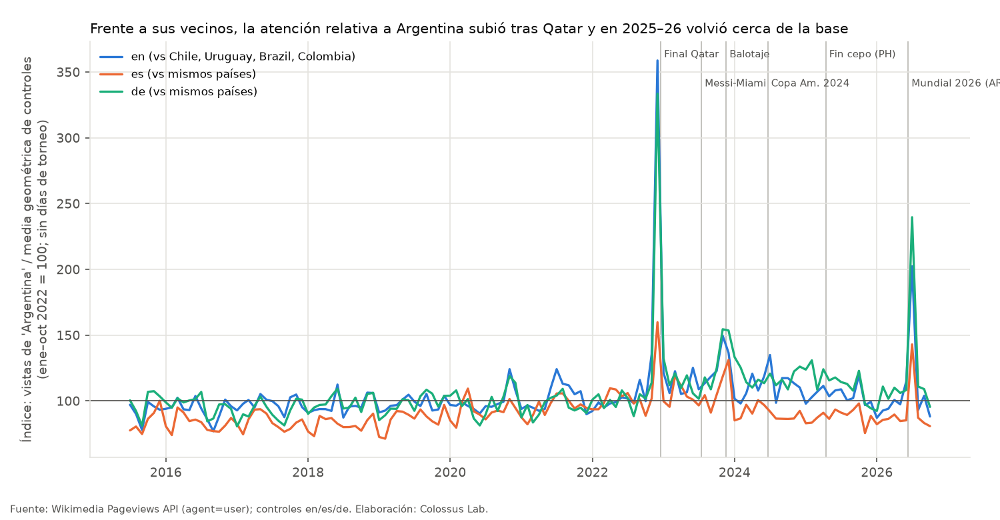
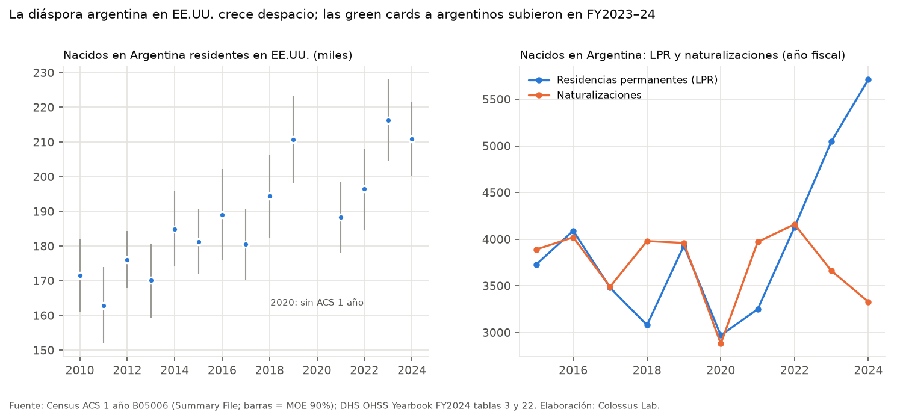
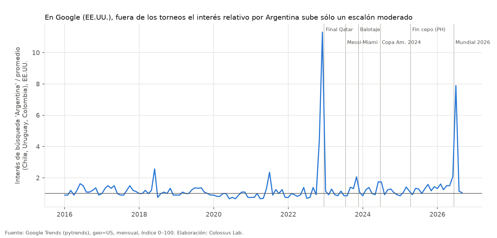
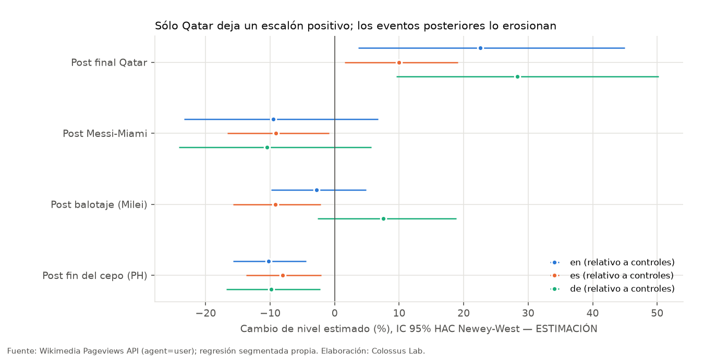
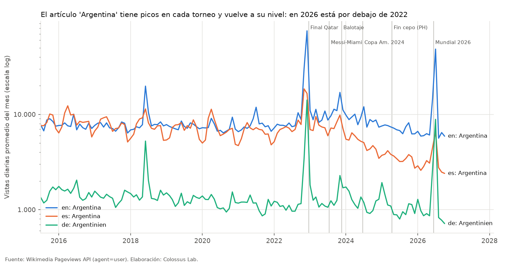
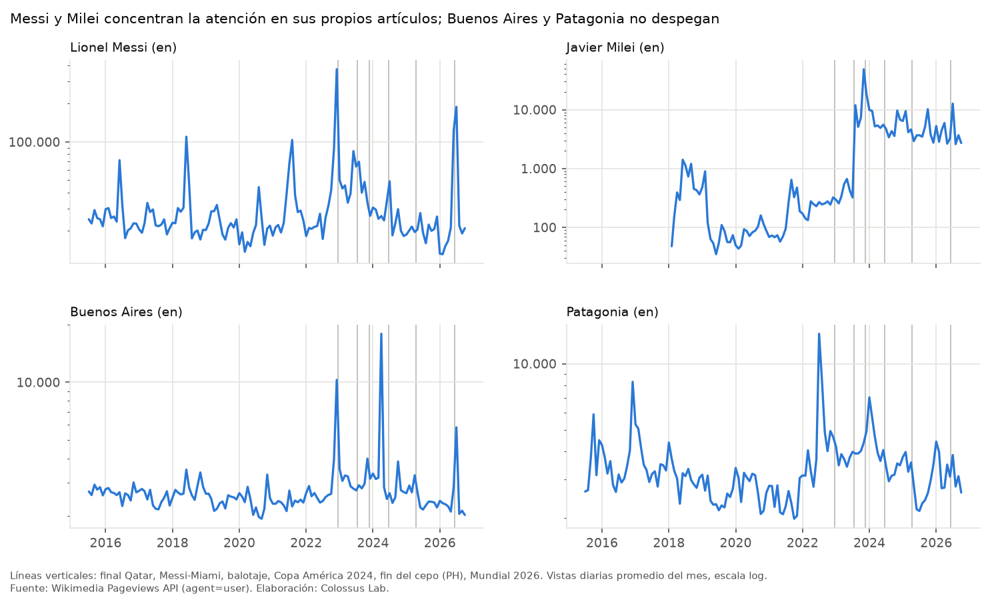
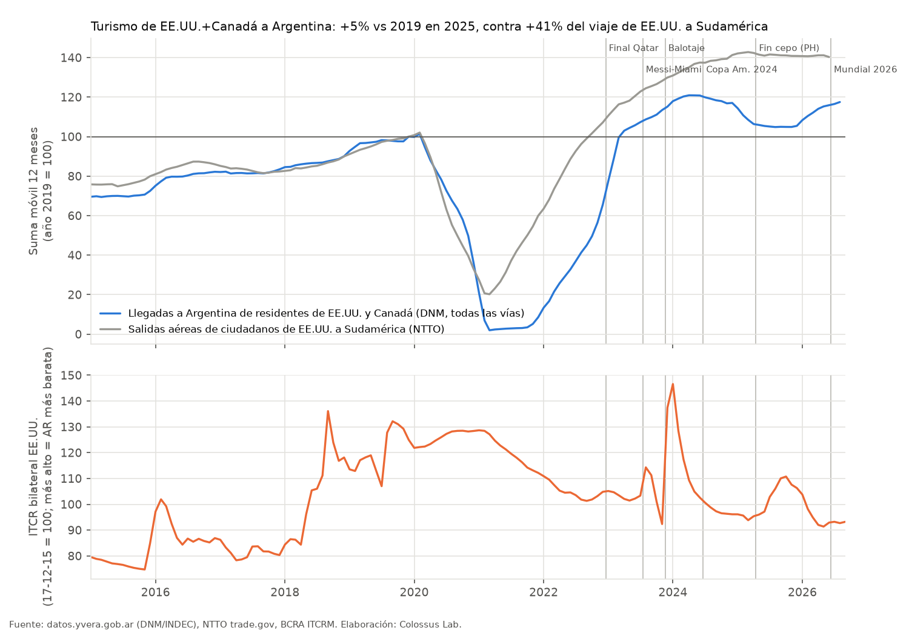

### Veredicto: "Argentina es más popular desde Qatar 2022"

**Se sostiene parcialmente** (**HIPÓTESIS**, apoyada en las estimaciones que siguen).

| Efecto | Evidencia a favor | Evidencia en contra |
|---|---|---|
| **Mundial Qatar** | Pico absoluto de la serie: 564.280 vistas el 18/12/2022 (E01). Escalón post-final de +22% (en), +28% (de) y +10% (es) relativo a controles, con IC que excluyen 0 (E07–E09). Binseg detecta sin fecha a priori un quiebre al alza el 20/11/2022 en inglés (+24%) y el 16/10/2022 en alemán (+24%) (E10). | El escalón decae unos 8 pp log por año y se anula hacia 05/2025 (E07). Binseg detecta quiebres a la baja el 07/01/2024 (−11%) y el 12/01/2025 (−7%) (E10). |
| **Messi-Miami (07/2023)** | El artículo "Lionel Messi" (en) se duplicó en 2023 (media geométrica 43.503 vs 22.867 vistas diarias en la base; `E_atencion_ventanas.csv`). | Sin escalón en "Argentina": −10% (p=0,23) en inglés, −9% (p=0,03) en español (E08). La atención va a Messi, no al país. |
| **Milei (balotaje y asunción)** | El artículo "Javier Milei" (en) pasó de ~200 a ~4.300 vistas diarias en 2025. En alemán el escalón del balotaje es +8%, no significativo (p=0,15). | Escalón en "Argentina" (en) de −3% (p=0,46); en español, −9% (p=0,01) (E08). Binseg ubica un quiebre a la baja 4 semanas después de la asunción: 07/01/2024, −11% en inglés y −16% en español (E10). En turismo, `post_milei` da −4% (p=0,15) (E23). |
| **Tipo de cambio / cepo** | Elasticidad de las llegadas EE.UU.+Canadá al ITCR bilateral (t−1) de 0,38 (IC95 0,17–0,59) (E23). EE.UU.+Canadá ganó participación en el total de turistas no residentes: del 7,2% en 2019 al 9,9% en 2025 (E33). | La salida (parcial) del cepo (14/04/2025, E28) llegó con un peso real más apreciado: ITCRB EE.UU. de 146,6 en ene-2024 a 95,4 en abr-2025 y 93,2 en sep-2026 (E22). La atención relativa cae −10% después de esa fecha (E08). La apreciación explica sólo un tercio de la caída del turismo en 2025 (E31). |
| **Mundial 2026** | 2.º mayor día de la serie: 218.272 vistas el 19/07/2026 (E02). En Google EE.UU., jul-2026 = 100, máximo histórico desde 2004 (E11). | Un mes después las vistas vuelven a su piso: ago–sep 2026 está 25% por debajo de 2022 (E03). El torneo se jugó en EE.UU., lo que infla la búsqueda local. **El resultado de Argentina en el Mundial 2026 no está verificado en fuente primaria descargable** (ver Fuentes fallidas). |

**Lo que va en contra de la tesis, con el mismo énfasis:**
- **ESTIMACIÓN:** en valores absolutos, el artículo "Argentina" (en) tuvo en 2025 un 11% menos de vistas diarias que en ene–oct 2022, y en ago–sep 2026 un 25% menos (E03). Parte de la caída es general: los controles también caen −15% (E04), una tendencia de toda Wikipedia en inglés.
- **ESTIMACIÓN:** en español, la atención relativa a Argentina está −12% bajo la base en 2025 y −15% en ago–sep 2026 (E06, `E_atencion_ventanas.csv`).
- **DATO / ESTIMACIÓN:** el turismo de EE.UU.+Canadá cayó −9,9% en 2025 (E13). CABA confirma 284.609 llegadas de estadounidenses (−11% i.a.; dato del plan re-verificado en la fuente oficial, E21). En Ezeiza+Aeroparque, el 1T-2025 cayó −11,6% (E17) y el 3T-2025 −3,9% (E18).
- **ESTIMACIÓN:** contra la "popularidad", Argentina recuperó mucho menos que el resto del destino Sudamérica: +5% vs 2019, frente a +41% de los viajes de EE.UU. a Sudamérica (E15).
- **ESTIMACIÓN:** con un control de demanda (viajes de EE.UU. a Sudamérica), el escalón post-Qatar en turismo baja a +9% y deja de ser significativo (p=0,35) (E23).
- **ESTIMACIÓN:** la diáspora argentina en EE.UU. (ACS) es estable: 210.767 en 2019 y 210.909 en 2024. El cambio 2022→2024 (+7%) no es estadísticamente significativo (E24–E25).

**Lo que va a favor y no hay que esconder:**
- **ESTIMACIÓN:** en Google EE.UU., el cociente Argentina/pares sigue +15% a +27% sobre la base pre-Qatar (E12).
- **DATO:** el 2026 muestra un rebote fuerte del turismo norteamericano. En el 1T-2026 llegaron 159,8 mil turistas (+28,9%) y en el 2T-2026 77,0 mil (+33,8%). El gasto total del 1T-2026 fue de USD 233,7 M (+52,4%) (E19–E20). Las llegadas de ene–ago 2026 crecen +17% contra ene–ago 2025, con datos provisorios (E14).
- **DATO:** las residencias permanentes (green cards) otorgadas a nacidos en Argentina pasaron de 4.130 (FY2022) a 5.710 (FY2024), el máximo de la serie 2015–2024 (E26). Esto mide emigración argentina hacia EE.UU., no atracción de estadounidenses hacia Argentina.

### Hallazgos y método

#### 1. Atención (Wikimedia Pageviews)
- **Datos:** API REST de Wikimedia, `agent=user`, `all-access`, diaria del 01/07/2015 al 02/10/2026. Se usaron 7 artículos foco: Argentina (en, es) y Argentinien (de), Buenos Aires, Lionel Messi, Javier Milei y Patagonia (en). Los controles en inglés son Chile, Uruguay, Brazil y Colombia. Como robustez se agregaron controles en el mismo idioma para es (Chile, Uruguay, Brasil, Colombia) y de (Chile, Uruguay, Brasilien, Kolumbien). Archivos: `data/raw/E_wikimedia_pv_*`; series en `data/processed/E_pageviews_{diarias,mensuales}.csv`.
- **Serie relativa:** `D = log(vistas Argentina) − media(log vistas controles)`, guardada en `E_atencion_relativa_diaria.csv`. Neutraliza la caída general de Wikipedia (E04) y el cambio de clasificación de tráfico automatizado de 2020, que afecta a todos los artículos por igual.
- **Ventanas descriptivas** (`E_atencion_ventanas.csv`): media geométrica sin los días de torneo (Mundiales 2018/22/26 y Copas América 2019/21/24), contra la base ene–oct 2022.
- **ITS** (`E_its_resultados.csv`): OLS sobre D (en/es/de) y sobre log(vistas en), con dummies de mes y de día de la semana, pulsos por cada torneo, un pulso por el anuncio CBI y errores HAC Newey-West (30 rezagos). M1 es la regresión segmentada clásica (nivel y pendiente post-18/12/2022). M2 agrega escalones acumulativos en Qatar (18/12/2022), Messi-Miami (15/07/2023, fecha de corte dentro de 07/2023), balotaje (19/11/2023) y cepo (14/04/2025). El balotaje y la asunción (10/12/2023) están a 21 días: no se separan, y el escalón del balotaje captura ambos.
- **Quiebres** (`E_quiebres.csv`): `ruptures.Binseg` con costo l2 sobre la media semanal de D, sin las semanas de torneo y sin fechas a priori. El número de quiebres sale del BIC: n·ln(RSS/n) + (2K+1)·ln(n). En inglés, el quiebre más fuerte es el de 23/05/2021, antes de Qatar, y el de 20/11/2022 es el tercero en orden de detección. Esto muestra que la serie ya era volátil antes del Mundial.
- **Temas:** el artículo "Messi" se duplica en 2023 y vuelve a la base en 2025. "Milei" pasa de ~200 a miles de vistas diarias. "Buenos Aires" y "Patagonia" no muestran un aumento sostenido: Patagonia está −30% bajo la base en 2025. Ver `E_pageviews_temas.png`.

#### 2. Google Trends EE.UU.
- **Datos:** pytrends funcionó al primer intento: `date=all`, `geo=US`, keywords Argentina, Buenos Aires, Chile, Uruguay y Colombia, guardado en `data/raw/E_gtrends_us_2026-10-03.csv`. Se analiza desde 2016 el cociente Argentina / promedio(Chile, Uruguay, Colombia), sin meses de torneo (`E_google_trends_*.csv`).
- **Si una re-ejecución falla (429 o bloqueo):** el script no insiste. Registra los dos intentos en `data/raw/E_gtrends_intentos_<fecha>.json` y sigue. Para reponer el dato a mano:
  1. En el navegador, abrir `https://trends.google.com/trends/explore?date=all&geo=US&q=Argentina,Buenos%20Aires,Chile,Uruguay,Colombia`.
  2. En "Interest over time", usar el botón de descarga (CSV).
  3. Quitar las 2 líneas de encabezado y renombrar las columnas a `date,Argentina,Buenos Aires,Chile,Uruguay,Colombia`. Las fechas van en formato AAAA-MM-01.
  4. Guardarlo como `data/raw/E_gtrends_us_<AAAA-MM-DD>.csv`. El script lo toma automáticamente.

#### 3. Turismo receptivo
- **DNM total país** (yvera, `turistas-no-residentes-serie.csv`): llegadas mensuales de "EE.UU. y Canadá" por medio de transporte, de ene-2010 a ago-2026. 2025–26 son datos provisorios. Es la serie principal porque cubre todos los pasos.
- **ETI** (INDEC/SECTUR, yvera): turistas y estadía de "EE.UU. y Canadá" en Ezeiza+Aeroparque, de 2014 a dic-2025. El gasto por residencia sale de los informes técnicos trimestrales de INDEC (1T-2025, 3T-2025, 1T-2026 y 2T-2026), verificado con cita literal (E17–E20). Yvera publica el gasto sólo por paso, no por residencia.
- **Advertencias:** la ETI cubre sólo aeropuertos y pasos seleccionados (Ezeiza, Aeroparque, Córdoba, Mendoza, Puerto de Buenos Aires y Cristo Redentor), no el total del país. **EE.UU. viene agregado con Canadá** en todas las series oficiales argentinas. Desde ene-2026, INDEC reagrupa Bolivia, Paraguay y Uruguay en "Resto de América" en algunas tablas.
- **Modelo** (`E_turismo_modelo.csv`): `log(llegadas EE.UU.+Can) ~ log(ITCRB EE.UU. t−1) + tendencia + post_qatar(2023-01) + post_milei(2023-12) + post_cepo(2025-04) + mundial26 + dummies de mes`. Muestra de 2014-01 a 2026-08, sin 2020-03..2022-03 (cierre de fronteras y reapertura), con HAC de 12 rezagos. T2 usa el ITCRM multilateral (elasticidad 0,34). T3 agrega log(viajes de EE.UU. a Sudamérica, NTTO) como control de demanda. Los coeficientes son **ESTIMACIÓN**.
- **NTTO:** sólo publica gratis el agregado por regiones ("South America"). El detalle I-92/APIS por país es de pago (E29). Por eso no hay serie pública de viajes EE.UU.→Argentina.

#### 4. Tipo de cambio real
BCRA `ITCRMSerie.xlsx`, hoja de promedios mensuales: ITCRM y bilateral EE.UU., base 17-12-15=100. Un valor más alto significa una Argentina más barata. El salto de dic-2023 a ene-2024 (146,6) se revirtió en 2024. En sep-2026 el bilateral está en 93,2; entre abr y sep de 2026 estuvo en los niveles más apreciados desde mediados de 2018 (mínimo 91,4 en may-2026) (E22).

#### 5. Diáspora y migración
- **ACS 1 año, tabla B05006** (nacidos en Argentina, total de nacidos en el extranjero y Sudamérica), 2010–2019 y 2021–2024. **No existe el ACS 1 año 2020** (no se publicó por la pandemia). La API `api.census.gov` exige ahora una key, que requiere registro. Por eso se usó el **Summary File oficial** (www2.census.gov): sequence-based para 2010–2021 y table-based para 2022–2024. Las estimaciones son las mismas que publica la API, con su margen de error (MOE) al 90% (`E_diaspora_acs_b05006.csv`).
- **DHS OHSS Yearbook FY2024:** residencias permanentes (LPR) por país de nacimiento (Tabla 3) y naturalizaciones (Tabla 22), FY2015–2024 (`E_dhs_lpr_naturalizaciones.csv`). Los valores vienen redondeados a la decena en la fuente.

#### 6. Eventos (`E_eventos.csv`)
| Fecha | Evento | Fuente / estado |
|---|---|---|
| 18/12/2022 | Final de Qatar 2022 | S (solo para fechar) |
| 07/2023 (corte 15/07/2023) | Messi al Inter Miami | S (aproximado al mes) |
| 19/11/2023 | Balotaje | S |
| 10/12/2023 | Asunción de Milei | S |
| 20/06–14/07/2024 | Copa América 2024 | S |
| 14/04/2025 | Salida del cepo para personas humanas: Com. "A" 8226 del 11/04/2025, "con vigencia a partir del 14/04/25" | **P, confirmada** (E28). Es una apertura **parcial**: habilita a personas humanas; no es la liberación total del mercado de cambios |
| 11/06–19/07/2026 | Mundial 2026 | S (fechas). **Resultado de Argentina: no verificado** |
| 02/10/2026 | Anuncio del Programa CBI | P (Módulo A) |

### Fuentes

| Fuente | Tipo | URL |
|---|---|---|
| Wikimedia Pageviews API (per-article, daily, agent=user) | P | https://wikimedia.org/api/rest_v1/metrics/pageviews/per-article/ |
| Google Trends (pytrends), geo=US | R | https://trends.google.com/trends/explore?date=all&geo=US&q=Argentina,Buenos%20Aires,Chile,Uruguay,Colombia |
| Yvera / DNM — Turismo internacional total país (receptivo) | P | https://datos.yvera.gob.ar/dataset/4cbf7d4a-702a-4911-8c1e-717a45214902 |
| Yvera / INDEC ETI — no residentes mensual Ezeiza+Aeroparque y gasto trimestral por paso | P | https://datos.yvera.gob.ar/dataset/78b880c1-50d5-4a0c-9c87-7350e70548c2 |
| INDEC — Estadísticas de turismo internacional (1T-25, 3T-25, 1T-26, 2T-26) | P | https://www.indec.gob.ar/uploads/informesdeprensa/eti_04_257F79FE4B90.pdf · eti_10_250B9725FF40.pdf · eti_04_261D31E891A2.pdf · eti_07_2611F2D28020.pdf |
| Ente de Turismo CABA — Perfil mercado EE.UU. 2025 | P | https://turismo.buenosaires.gob.ar/sites/turismo/files/eeuu_perfiles_internacionales_2025.pdf |
| NTTO (trade.gov) — U.S. citizen travel to international regions | P | https://www.trade.gov/sites/default/files/2024-02/US-Outbound-to-World-Regions.xlsx |
| NTTO — página del programa I-92 (precios) | P | https://www.trade.gov/us-international-air-travel-statistics-i-92-data |
| BCRA — ITCRM y bilaterales | P | https://www.bcra.gob.ar/archivos/Pdfs/PublicacionesEstadisticas/ITCRMSerie.xlsx |
| BCRA — Comunicación "A" 8226 | P | https://www.bcra.gob.ar/archivos/Pdfs/comytexord/A8226.pdf |
| U.S. Census Bureau — ACS 1-year Summary File, B05006 (2010–2024) | P | https://www2.census.gov/programs-surveys/acs/summary_file/ |
| DHS OHSS — Yearbook FY2024, LPR (Tabla 3) | P | https://ohss.dhs.gov/system/files/2026-06/2026_0604_ohss_yearbook_lawful_permanent_residents_fy2024.xlsx |
| DHS OHSS — Yearbook FY2024, Naturalizations (Tabla 22) | P | https://ohss.dhs.gov/system/files/2026-06/2026_0604_ohss_yearbook_naturalizations_fy2024.xlsx |
| FIFA / prensa (solo para fechar eventos deportivos y políticos) | S | — |

### Fuentes fallidas

| Fecha | Fuente | URL | Error | Causa | Acción |
|---|---|---|---|---|---|
| 2026-10-03 | Census API ACS B05006 | https://api.census.gov/data/2023/acs/acs1?get=NAME,B05006_001E&for=us:1 | HTTP 302 → `missing_key.html` | La API exige una key, y la key requiere un formulario de registro. **Ojo:** `docs/probe_fuentes.csv` marca esta fuente como OK, pero su URL final es `missing_key.html` (falso positivo del probe) | Se usó el ACS Summary File oficial (mismas estimaciones) |
| 2026-10-03 | Wikimedia Pageviews API | https://wikimedia.org/api/rest_v1/metrics/pageviews/… | HTTP 429 intermitente (envoy rate limit, `retry-after: 1`) | Límite por IP compartida del proxy | Reintentos espaciados (`download_retry`); las 19 series se bajaron completas |
| 2026-10-03 | DHS OHSS (ohss.dhs.gov) con curl | https://ohss.dhs.gov/topics/immigration/yearbook | HTTP 403 (Akamai) | Anti-bots que bloquea a curl; con `requests` (src/common.py) responde 200 | Se descargaron los xlsx con `download()`. La Wayback Machine (web.archive.org) cortaba la conexión vía el proxy (`ws_closed_mid_exchange`) y no hizo falta |
| 2026-10-03 | FIFA (resultado del Mundial 2026) | https://www.fifa.com/en/tournaments/mens/worldcup/canadamexicousa2026/articles/spain-argentina-final-report-highlights | El HTML no trae contenido (se renderiza con JavaScript); la captura Wayback no se pudo bajar | Sitio JS; el endpoint `cxm-api.fifa.com` es una API no documentada y no se usó | **Resultado de Argentina: no verificado.** Los buscadores (S) indican que Argentina fue finalista, pero no se usa como dato |
| 2026-10-03 | NTTO I-92 / APIS por país de destino | https://www.trade.gov/us-international-air-travel-statistics-i-92-data | Producto de pago (USD 150 a USD 5.795) | Licencia comercial | Se usó el agregado gratuito "South America" como control de demanda (E29) |
| 2026-10-03 | INDEC, página de la ETI | https://www.indec.gob.ar/indec/web/Nivel4-Tema-3-13-56 | La página no lista cuadros xls (se carga por JavaScript) | Sitio dinámico | Se usaron yvera (CKAN) y los PDF de informes técnicos ubicados por buscador |

### Limitaciones
- **Pageviews ≠ intención de inversión ni de residencia.** Wikipedia mide curiosidad, mayormente deportiva y noticiosa. Los picos son torneos, y los escalones son modestos y transitorios. Ninguna de estas series mide demanda de ciudadanía por inversión.
- Wikipedia en inglés pierde tráfico en forma general (los controles caen −15% entre 2022 y 2025; E04). Por eso la medida relevante es la relativa (D). Los controles (Chile, Uruguay, Brasil y Colombia) también tienen shocks propios: estallido en Chile, Copa América 2024 en EE.UU. con Colombia y Uruguay, entre otros.
- La ITS supone que, sin eventos, D sigue una tendencia lineal con estacionalidad. Los escalones son acumulativos y los eventos cercanos (balotaje y asunción, a 21 días) no se pueden separar. Los coeficientes son **ESTIMACIÓN** con HAC; la autocorrelación diaria es alta.
- **Google Trends:** el índice es relativo (0–100) y redondeado a enteros. Con valores bajos (Uruguay = 1), el cociente es ruidoso y está dominado por Colombia. Google cambió su recolección el 01/01/2016 y el 01/01/2022; la base pre-Qatar (ene–oct 2022) queda después del último cambio. El Mundial 2026 se jugó en EE.UU., lo que infla las búsquedas locales de jun–jul 2026.
- **Turismo:** EE.UU. viene agregado con Canadá. La ETI cubre sólo pasos seleccionados. Los datos de 2025–26 de la DNM son provisorios. NTTO mide salidas aéreas de ciudadanos de EE.UU. (incluye escalas y otro universo), por lo que la comparación con la DNM es de tendencias (índice 2019 = 100), no de niveles. El modelo omite variables como conectividad aérea, precios relativos de pasajes y seguridad percibida.
- **ACS:** es una muestra, con MOE de ±10–13 mil personas. Las variaciones interanuales en general no son significativas (E25). Las LPR y naturalizaciones miden emigración argentina, no "popularidad" entre estadounidenses.
- **Mundial 2026:** el resultado de Argentina no está verificado en fuente primaria. El análisis usa sólo la ventana del torneo (11/06–19/07/2026), que también es S.

## Módulo E (extensión) — Búsquedas en Google sobre el pasaporte y la ciudadanía argentina

Google Trends da índices **relativos** de 0 a 100 dentro de cada consulta, no volúmenes. Los índices salen de una muestra que puede variar entre pedidos, y los rankings por país están normalizados por el total de búsquedas de cada país. Por eso todo número derivado es **ESTIMACIÓN**, y la fuente es tipo **R**. Las consultas crudas están en `data/raw/E2_gt_Q*_2026-10-03.csv`.

**Resumen (5 líneas)**
1. **DATO / ESTIMACIÓN:** en EE.UU., el interés por "argentina passport" fue plano entre 2021 y mediados de 2025, con un promedio anual de 2 a 4. En 2026 promedia 32,5, y "argentina citizenship" pasó de 0,3 a 19,7 en el mismo período (E51, E52). El máximo de 5 años es la semana del 28/06/2026 (E50).
2. **HIPÓTESIS:** el primer salto (semana del 27/07/2025, índice 57) coincide con la declaración de intención del 28/07/2025 para el reingreso de Argentina al Visa Waiver Program (D28). El pico de junio y julio de 2026 coincide con el Mundial en EE.UU. La suba sostenida desde noviembre de 2025 no tiene una causa identificada en fuente primaria. Que coincidan en fecha no prueba la causa.
3. **ESTIMACIÓN:** el anuncio del 02/10/2026 tuvo reacción inmediata. En EE.UU., el índice horario de "argentina citizenship" pasó de 0,1 a 13,2 de promedio, y en el mundo de 0,7 a 30,5. El máximo fue a las 19:00 UTC del 02/10 en los dos casos (E53, E54, E63, E64). Las consultas relacionadas en mayor ascenso de la semana son "argentina citizenship by investment program" (+1.300%) y "argentina citizenship by investment" (+450%) (E62).
4. **ESTIMACIÓN:** en las últimas 52 semanas, en EE.UU., "argentina citizenship" (26,1) superó a "portugal golden visa" (21,2) y quintuplicó a "dominica citizenship" (5,2), "st kitts citizenship" (3,2) y "turkey citizenship by investment" (3,4) (E70). **Contrapeso:** "argentina citizenship" también captura la ciudadanía por descendencia, por matrimonio y por residencia, que no tienen nada que ver con el programa CBI.
5. **DATO (con cautela):** fuera de EE.UU., el interés relativo por "argentina citizenship" más alto en 12 meses está en Suiza (44), Rusia (43), Finlandia (42), Suecia, Hungría y Portugal (E57). En español, "pasaporte argentino" pesa más en España (92), México (88) y Chile (87) (E60). **HIPÓTESIS:** que Rusia aparezca coincide con el índice de movilidad del Módulo B (B31). Los rankings de términos de bajo volumen son ruidosos: la primera corrida, que incluía países de bajo volumen, ponía a Guinea Ecuatorial y St. Kitts en 100, y en portugués aparece Sri Lanka.

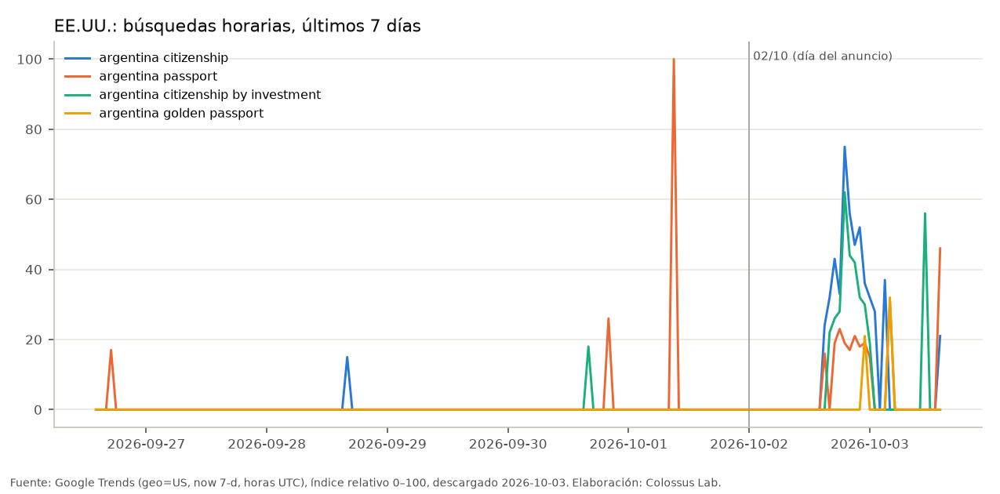
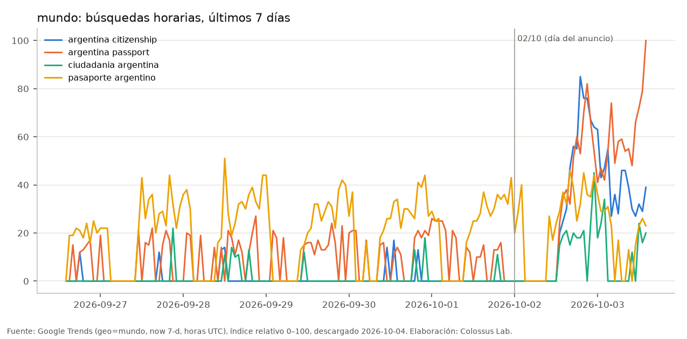
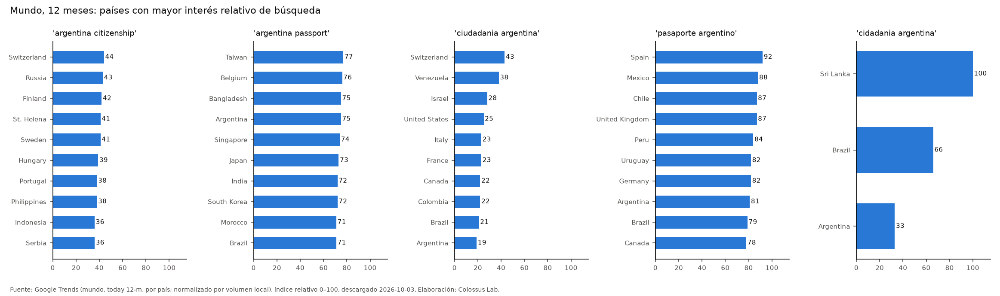
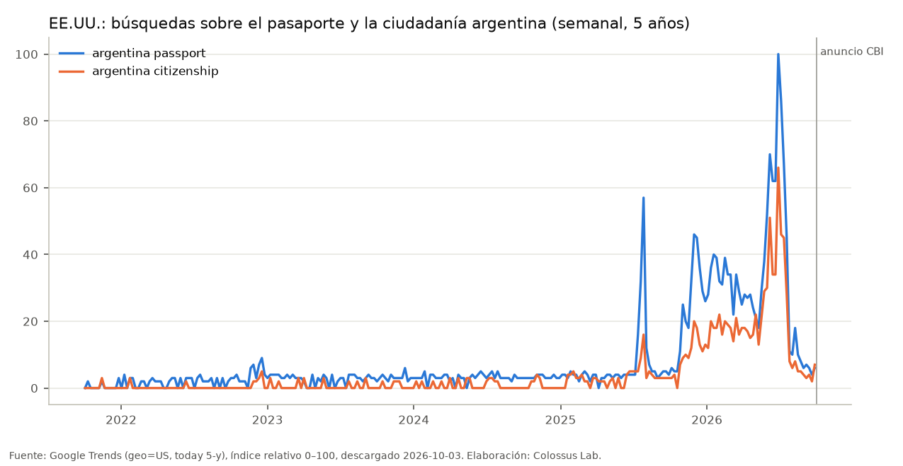

### Gráficos
- `outputs/charts/E2_us_pasaporte_5y.{png,svg}`: EE.UU., serie semanal de 5 años.
- `outputs/charts/E2_Q2_7dias`, `E2_Q3_7dias`: reacción horaria al anuncio, en EE.UU. y en el mundo.
- `outputs/charts/E2_paises`: países con mayor interés relativo, por término.

### Método
`src/05b_busquedas_pasaporte.py`: 8 consultas vía pytrends, con 75 s de pausa entre una y otra y como máximo 2 intentos por consulta. Cada respuesta cruda se guarda con fecha y se reutiliza si ya existe. Los rankings por país usan `inc_low_vol=False`, que excluye a los países con volumen insuficiente.

### Fuentes
| Fuente | Tipo | URL |
|---|---|---|
| Google Trends (vía pytrends 4.9.2) | R | https://trends.google.com/trends/explore |

### Fuentes fallidas
| Fecha | Fuente | Error | Acción |
|---|---|---|---|
| 2026-10-03 | Google Trends | 429 en el primer intento | Segundo intento espaciado con User-Agent identificable: OK |

### Limitaciones
- No son volúmenes: un índice de 30 en un término de bajo volumen puede representar pocas búsquedas.
- Términos en inglés y español: el interés en otros idiomas (chino, ruso, árabe) no está medido.
- La semana del anuncio está incompleta (`isPartial`) en la serie semanal.

## Módulo F — "Refugio austral": Argentina frente a Nueva Zelanda, Uruguay, Chile, Portugal y Canadá

**Fecha de corte:** 2026-10-03 · **Script:** `src/06_refugio.py` · **Ledger:** `docs/claims/claims_F.csv` (F001–F122)

### Resumen (5 líneas)

1. **DATO / ESTIMACIÓN — a favor:** Argentina produce 2,7 veces los cereales que consume (promedio 2019–2023), y es la única de las seis cuya producción cubre el 100% de las calorías de su dieta en los 15 grupos de FAOSTAT. Además tiene 11,9% de las reservas mundiales de litio y los mayores recursos del listado del USGS (28 Mt). Desde 2025 es exportadora neta de energía: Vaca Muerta ya aporta 72% del petróleo y 62% del gas del país (F036, F037, F064, F070–F072, F057, F062).
2. **DATO — en contra (instituciones y paz):** Argentina está **última de las seis** en los cuatro indicadores WGI 2025: Rule of Law −0,10, Control of Corruption −0,39, Government Effectiveness 0,28 y Political Stability 0,16. También queda última en el WJP 2025 (0,54, puesto 65 de 143) y en el Global Peace Index 2026 (puesto 72 de 163, el mayor deterioro de Sudamérica) (F001–F030, F032, F113–F118).
3. **DATO / ESTIMACIÓN — en contra (macro):** según la base BoC–BoE, Argentina tuvo deuda soberana en default en 47 de los 65 años entre 1960 y 2024, más que los otros cinco juntos (28). La inflación fue de 219,9% en 2024 (WB) y de ~41,9% promedio en 2025 (INDEC). En agosto de 2026 sigue en 33,5% interanual, frente al 2–5% de los comparables (F079–F084, F089–F102).
4. **DATO — controles de capital:** el corralito de 2001 (Dec. 1570/2001: tope de USD 250 semanales en efectivo) y dos cepos cambiarios (11/11/2011–17/12/2015 y 01/09/2019–14/04/2025) suman ~9,7 años de cepo para personas humanas en 2011–2025. La salida de 2025 rige desde el 14/04/2025 (Com. "A" 8226) y es parcial: las empresas mantienen restricciones (F103–F112).
5. **HIPÓTESIS — veredicto:** el relato del "refugio austral" se sostiene **solo en la dimensión de recursos** (alimentos, energía, litio y, en menor medida, naturaleza). En las dimensiones que deciden si un patrimonio está a salvo (estabilidad macro, Estado de derecho, convertibilidad de la moneda), Argentina es la peor de las seis, sin excepción. Un comprador de ciudadanía como "seguro" compra un activo que tiene una ventaja real y una debilidad, también real, que no se anulan entre sí.

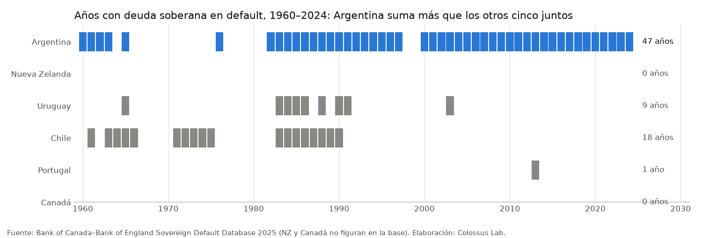
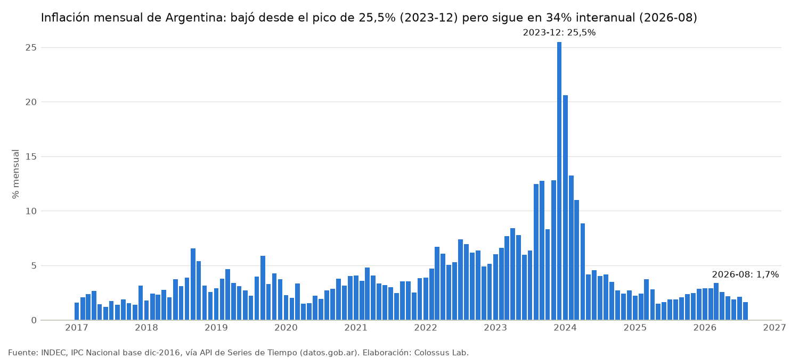
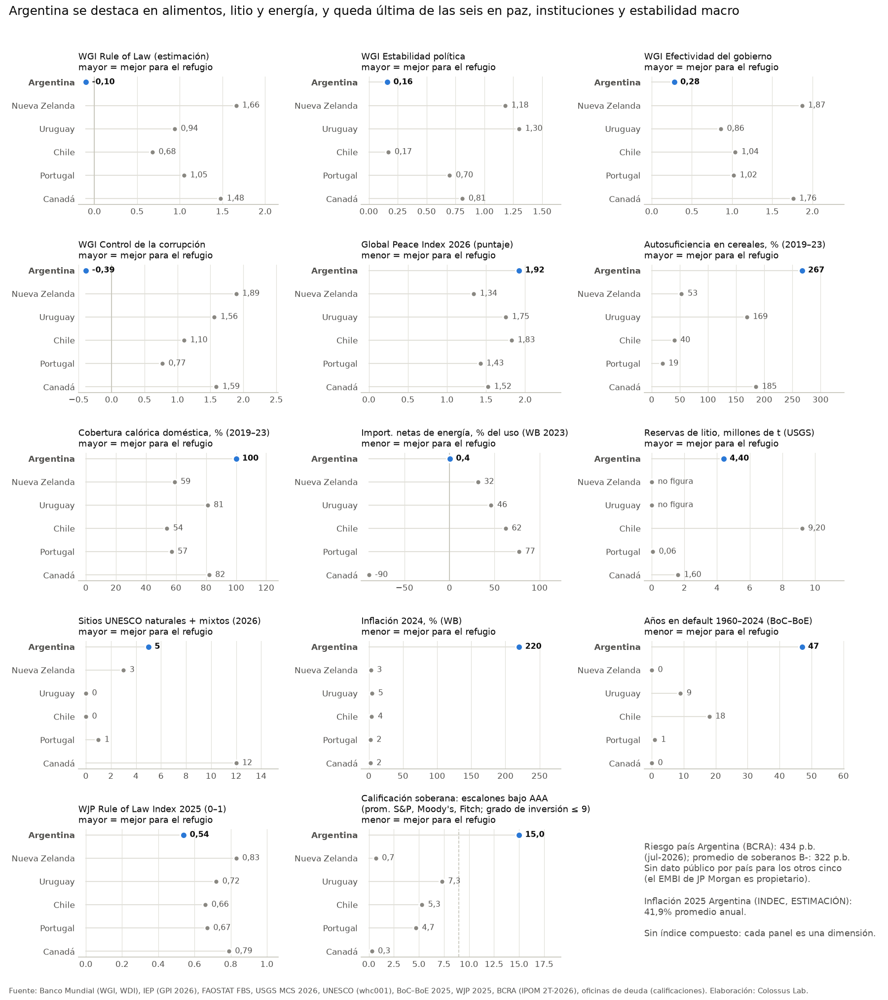
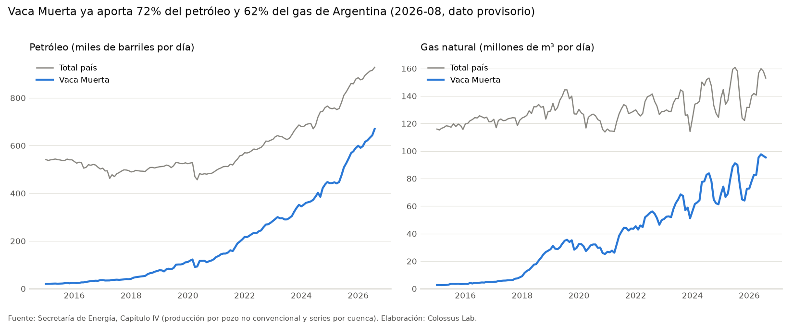
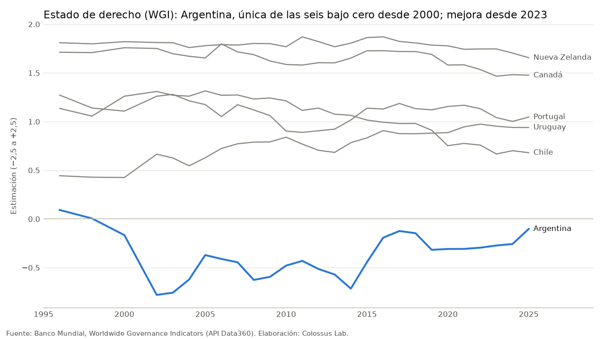

### Tabla resumen (DATO / ESTIMACIÓN por celda, con año; sin índice compuesto)

| Dimensión | Indicador (año) | ARG | NZL | URY | CHL | PRT | CAN | Etiqueta / claims |
|---|---|---|---|---|---|---|---|---|
| Paz y gobernanza | WGI Rule of Law, estimación (2025) | **−0,10** | 1,66 | 0,94 | 0,68 | 1,05 | 1,48 | DATO F001–F006 |
| | WGI Political Stability (2025) | **0,16** | 1,18 | 1,30 | 0,17 | 0,70 | 0,81 | DATO F007–F012 |
| | WGI Government Effectiveness (2025) | **0,28** | 1,87 | 0,86 | 1,04 | 1,02 | 1,76 | DATO F013–F018 |
| | WGI Control of Corruption (2025) | **−0,39** | 1,89 | 1,56 | 1,10 | 0,77 | 1,59 | DATO F019–F024 |
| | Global Peace Index 2026: puntaje (puesto/163) | **1,922 (72)** | 1,343 (2) | 1,754 (43) | 1,826 (52) | 1,427 (7) | 1,525 (14) | DATO F025–F031 |
| Alimentos | Autosuficiencia en cereales, % (2019–23; entre paréntesis, 2023) | **267 (214)** | 53 (52) | 169 (171) | 40 (38) | 19 (18) | 185 (194) | ESTIMACIÓN F036–F046 |
| | Cobertura calórica doméstica, % (2019–23) | **100** | 59 | 81 | 54 | 57 | 82 | ESTIMACIÓN F037–F047 |
| Energía | Importaciones netas de energía, % del uso (WB; URY 2022) | **0,4 (2023)** | 31,6 | 46,2 | 62,3 | 77,2 | −89,6 | DATO F048–F053 |
| | ídem, BEN 2025 provisorio (SE) | **−13,2 (2025)** | | | | | | ESTIMACIÓN F057 |
| Litio | Reservas, t de Li (USGS, 2025) | **4.400.000** | no figura | no figura | 9.200.000 | 60.000 | 1.600.000 | DATO F064–F069 |
| | Producción minera 2025e, t de Li | **23.000** | no figura | no figura | 56.000 | 380 | 5.600 | DATO F064–F069 |
| Atractivo natural | Sitios UNESCO, total (lista a 2026) | **12** | 3 | 3 | 7 | 17 | 22 | DATO F073–F078 |
| | Sitios UNESCO naturales + mixtos | **5** | 3 | 0 | 0 | 1 | 12 | DATO F073–F078 |
| **Contrapesos** | Años con deuda en default, 1960–2024 (de 65) | **47** | 0* | 9 | 18 | 1** | 0* | ESTIMACIÓN F079–F084 |
| | Inflación 2024, % promedio anual (WB) | **219,9** | 2,9 | 4,8 | 4,3 | 2,4 | 2,4 | DATO F089–F098 |
| | Inflación 2025, % promedio anual | **41,9 (INDEC)** | 2,8 | 4,7 | 4,2 | 2,3 | 2,1 | DATO F091–F099; ARG ESTIMACIÓN F102 |
| | Riesgo país (EMBI) | s/d | s/d | s/d | s/d | s/d | s/d | sin fuente pública abierta |
| | Años con cepo cambiario (personas), 2011–2025 | **9,7** | n/r | n/r | n/r | n/r | n/r | ESTIMACIÓN F112 |
| | WJP Rule of Law Index 2025 (puesto/143) | **0,54 (65)** | 0,83 (5) | 0,72 (23) | 0,66 (35) | 0,67 (29) | 0,79 (13) | DATO F113–F119 |

\* HIPÓTESIS: Nueva Zelanda y Canadá **no figuran** en la base BoC–BoE (166 soberanos/territorios con algún default desde 1960); se interpreta como cero (F080, F084).
\*\* Portugal 2013: la base computa como default la extensión de plazos de los préstamos oficiales de la UE, porque implicó pérdida en valor presente para los acreedores, aunque no se interrumpió ningún pago (F088).
n/r = no relevado en este módulo (no se asume que los comparables no tuvieron controles).

### Hallazgos y método

#### 1. Paz y gobernanza
- **DATO:** WGI 2025 (Banco Mundial, actualizado el 25/09/2026). Argentina es la peor de las seis en los cuatro indicadores. En Political Stability está prácticamente empatada con Chile (0,16 contra 0,17) (F007, F010).
- **DATO:** en Rule of Law, Argentina está por debajo de cero desde 2000 (−0,17), con un mínimo de −0,78 en 2002. Mejora desde 2023 (−0,27 → −0,10 en 2025). Ninguno de los comparables bajó de 0,4 en toda la serie (`data/processed/F_wgi_serie.csv`; gráfico `F_wgi_rule_of_law`).
- **DATO:** GPI 2026: Argentina está en el puesto 72 de 163, con un puntaje de 1,922. Registró el mayor deterioro porcentual de la región (−6,1%), impulsado por el dominio "Ongoing Conflict" (F025, F032, F033). Nueva Zelanda (2.º) y Portugal (7.º) están en el top 10.
- Método: API Data360 del Banco Mundial (bases WB_WGI y WB_WDI). Se usó la estimación (`WGI_EST`, escala aprox. −2,5 a +2,5). El JSON también trae el puntaje 0–100 (`WGI_SC`).

#### 2. Autosuficiencia alimentaria (ESTIMACIÓN)
- **Método:** FAOSTAT Food Balance Sheets (descarga masiva normalizada, archivo del 14/10/2025; último año disponible: 2023). Para cada grupo g: `SSR_g = Σ Producción (5511) / Σ Suministro interno (5301)`, en toneladas, sumando 2019–2023. La "cobertura calórica doméstica" es `Σ_g kcal_g × min(SSR_g, 100%) / Σ_g kcal_g`, sobre 15 grupos (cereales, raíces, azúcar, legumbres, frutos secos, oleaginosas, aceites, hortalizas, frutas, carne, menudencias, grasas animales, leche, huevos y pescado). kcal_g es el suministro alimentario promedio 2019–2023 (kcal/persona/día). El tope en 100% evita que el excedente exportable de un grupo "compense" el déficit de otro.
- **ESTIMACIÓN:** Argentina: cereales 267%, aceites vegetales 253%, carne 116% y leche 118%. Solo frutos secos (51%) quedan bajo 100%, y pesan 5 kcal/día. Cobertura calórica: 100% (F036, F037; detalle en `data/processed/F_fao_autosuficiencia.csv`).
- **DATO:** en 2023, año de sequía, la autosuficiencia en cereales de Argentina cayó a 214%: producción de 62.554 kt contra un suministro interno de 29.265 kt (F034, F035). La de oleaginosas bajó a 74%. La ventaja es estructural, pero depende del clima.
- **HIPÓTESIS:** Nueva Zelanda y Uruguay son autosuficientes en proteína animal (carne 288% y 328%), pero importan cereales, aceites y azúcar. Para un "refugio" ante un corte del comercio mundial, el perfil argentino es el más completo de las seis.

#### 3. Energía
- **DATO:** en agosto de 2026, Vaca Muerta produjo 3,30 millones de m³ de petróleo y 2,96 millones de miles de m³ de gas (declaraciones juradas por pozo, provisorias). La producción total del país fue de 928 mil bbl/d de petróleo y 153 MMm³/d de gas (F058–F061).
- **ESTIMACIÓN:** eso equivale a ~670 mil bbl/d de petróleo de Vaca Muerta (72% del total) y ~95 MMm³/d de gas (62%). El petróleo de Vaca Muerta creció 27% interanual (F062, F063). Gráfico `F_vaca_muerta`.
- **ESTIMACIÓN:** según el Balance Energético Nacional 2025 (provisorio), la producción primaria fue de 95.387 ktep contra una oferta interna de 84.237 ktep. Las importaciones netas fueron entonces de −13,2% del uso, es decir, Argentina fue **exportadora neta** (F054–F057). Según el Banco Mundial (2023), Argentina estaba en equilibrio (0,4%). Nueva Zelanda, Uruguay, Chile y Portugal importan entre 32% y 77% de su energía; solo Canadá (−89,6%) es más exportador (F048–F053).
- Nota: la serie de producción "shale" de la Secretaría de Energía (3,31 Mm³ en agosto de 2026) coincide casi exactamente con la suma pozo a pozo de la formación Vaca Muerta (3,30 Mm³).

#### 4. Litio
- **DATO (USGS MCS 2026):** Argentina produjo 13.800 t en 2024 ("reported") y 23.000 t en 2025e, y tiene reservas de 4,4 Mt. Chile: 48.900 / 56.000 t y 9,2 Mt. Canadá: 5.600 t y 1,6 Mt. Portugal: 380 t y 60.000 t. Nueva Zelanda y Uruguay no figuran. El mundo: 290.000 t (sin EE.UU.) y 37 Mt de reservas (F064–F070).
- **ESTIMACIÓN:** Argentina tiene 11,9% de las reservas y 7,9% de la producción mundial (F072). **DATO:** tiene los mayores recursos medidos e indicados del listado (28 Mt, por delante de Bolivia con 23 Mt) (F071). Nota de extracción: en el PDF, la cifra 2024 de Argentina y Chile lleva la nota al pie "5" (Reported) pegada, por eso la cita literal dice "513,800".

#### 5. Atractivo natural
- **DATO:** según la Lista del Patrimonio Mundial (UNESCO Open Data, dataset whc001, modificado el 2026-10-02), Argentina tiene 12 sitios, 5 de ellos naturales. Canadá tiene 22 (12 naturales o mixtos), Portugal 17 (1), Chile 7 (0), y Nueva Zelanda y Uruguay 3 cada uno (Nueva Zelanda, 3 naturales o mixtos; Uruguay, 0) (F073–F078). Los sitios transfronterizos se cuentan en cada país. Argentina queda segunda en patrimonio natural.

#### 6. Contrapesos
- **Defaults (ESTIMACIÓN sobre DATO, BoC–BoE 2025):** Argentina registra deuda en default en 47 de 65 años (1960–2024): 1960–63, 1965, 1976, 1982–97 y 2000–2024 de forma ininterrumpida. Chile suma 18 años (concentrados en 1961–1990) y Uruguay 9 (el último, 2003). En el criterio se cuenta todo año con un stock en default mayor que cero, incluidos montos chicos y holdouts. **DATO:** bonos en moneda extranjera en default por USD 84.830 millones en 2001 y USD 70.503 millones en 2020. En 2024 todavía quedaban USD 2.687 millones clasificados en default (F079–F087).
- **Inflación:** **DATO:** el IPC Nacional de INDEC marcó 1,7% mensual y 33,5% interanual en agosto de 2026. Diciembre 2025 contra diciembre 2024: 31,5% (F100, F101). **ESTIMACIÓN:** el promedio anual de 2025, comparable con FP.CPI.TOTL.ZG, fue 41,9% (F102). Gráfico `F_inflacion_arg`. **HIPÓTESIS:** la desinflación desde el pico (25,5% mensual en diciembre de 2023) es real, pero la inflación interanual de agosto de 2026 está por encima de la de diciembre de 2025: el proceso se estancó.
- **Riesgo país:** no hay serie pública abierta. Se buscó en la API de Series de Tiempo de datos.gob.ar ("riesgo país", "embi", "spread", "prima de riesgo") y en las 1.610 variables de la API v4.0 del BCRA. Las series de rendimientos de bonos soberanos de datos.gob.ar terminan en 2019–2020. Queda como **s/d** (ver Fuentes fallidas).
- **Controles de capital (DATO, normativa):**
  - Dec. 1570/2001, del 01/12/2001: retiros en efectivo limitados a $250 o USD 250 por semana y prohibición de transferencias al exterior (F103, F104).
  - Com. "A" 5245: validación de la AFIP, vigente desde el 11/11/2011. Se levanta con la Com. "A" 5850, el 17/12/2015 (F105, F106).
  - DNU 609/2019 y Com. "A" 6770 (01/09/2019): conformidad previa del BCRA por encima de USD 10.000 mensuales. La Com. "A" 6815 (28/10/2019) baja el tope a USD 200 (F107–F109).
  - Com. "A" 8226: vigente desde el 14/04/2025, permite a las personas humanas comprar divisas sin conformidad previa. Las empresas solo pueden girar dividendos de ejercicios iniciados desde el 01/01/2025 (F110, F111).
  - **ESTIMACIÓN:** 9,7 años de cepo para personas entre 2011 y 2025 (F112).
  - **No verificado:** si después del 14/04/2025 hubo nuevas restricciones o una liberalización total para empresas. No se revisó la normativa posterior.
- **Estado de derecho (DATO):** WJP 2025: Argentina 0,54 (puesto 65 de 143, −1,0%). Es la peor de las seis; la siguiente es Chile, con 0,66 (F113–F119).

#### 7. Geopolítica (solo hechos con fuente primaria)
- **DATO:** Argentina y EE.UU. firmaron el Acuerdo sobre Comercio e Inversiones Recíprocos el 05/02/2026, anunciado el 13/11/2025 (Cancillería, F120).
- **DATO:** el Exchange Stabilization Fund del Tesoro de EE.UU. tiene un acuerdo de estabilización por USD 20.000 millones con el BCRA. En octubre de 2025 se ejecutó un swap por USD 2.500 millones (U.S. Treasury, F121, F122).
- **HIPÓTESIS:** el alineamiento con EE.UU. reduce el riesgo de aislamiento. Pero un rescate cambiario externo en 2025 es, en sí mismo, evidencia de fragilidad macro, no de "refugio".

#### Veredicto
| Bien posicionada (recursos) | Peor posicionada (macro e instituciones) |
|---|---|
| **DATO/ESTIMACIÓN:** autosuficiencia alimentaria máxima de las seis (cereales 267%, cobertura calórica 100%) | **DATO:** última en los 4 indicadores WGI, en WJP y en GPI |
| **ESTIMACIÓN:** exportadora neta de energía en 2025 (−13,2%); Vaca Muerta con 72% del petróleo nacional | **ESTIMACIÓN:** 47 de 65 años con deuda en default; hay deuda en default en todos los años desde 2000 |
| **DATO:** 2.ª en reservas de litio (4,4 Mt) y 1.ª en recursos (28 Mt) | **DATO:** inflación de 219,9% (2024) y 33,5% interanual (agosto de 2026), contra 2–5% de los comparables |
| **DATO:** 2.ª en sitios UNESCO naturales (5) | **DATO:** corralito de 2001 y ~9,7 años de cepo en 2011–2025; salida parcial en abril de 2025 |
| | **DATO:** el mayor deterioro de Sudamérica en el GPI 2026 |

**HIPÓTESIS:** el "refugio austral" describe bien a un país que podría alimentarse y abastecerse de energía solo. No describe un lugar donde un patrimonio financiero esté protegido de la expropiación monetaria, los defaults o los controles de capital, que son justamente los riesgos que un comprador de CBI suele querer cubrir. Los comparables ofrecen las instituciones sin tener los recursos de Argentina (salvo Canadá, que tiene ambos). La mejora reciente es real pero corta y todavía no aparece en los rankings de largo plazo: Rule of Law −0,27 → −0,10 entre 2023 y 2025, inflación en baja desde 2023 y salida del cepo en 2025.

### Fuentes

| Fuente | Tipo | URL |
|---|---|---|
| Banco Mundial, WGI (API Data360) | P | https://data360api.worldbank.org/data360/data?DATABASE_ID=WB_WGI&INDICATOR=GOV_WGI_RL (ídem PV, GE, CC) |
| Banco Mundial, WDI FP.CPI.TOTL.ZG y EG.IMP.CONS.ZS (API Data360) | P | https://data360api.worldbank.org/data360/data?DATABASE_ID=WB_WDI&INDICATOR=WB_WDI_FP_CPI_TOTL_ZG |
| IEP, Global Peace Index 2026 (informe PDF) | R | https://www.visionofhumanity.org/wp-content/uploads/2026/06/Global-Peace-Index-2026-Report.pdf |
| World Justice Project, Rule of Law Index 2025 (PDF) | R | https://worldjusticeproject.org/rule-of-law-index/downloads/WJPIndex2025.pdf |
| FAOSTAT, Food Balance Sheets (bulk) | P | https://bulks-faostat.fao.org/production/FoodBalanceSheets_E_All_Data_(Normalized).zip |
| Secretaría de Energía, producción por cuenca y subtipo (petróleo y gas) | P | https://datos.energia.gob.ar/dataset/produccion-de-petroleo-y-gas-por-pozo |
| Secretaría de Energía, producción por pozo no convencional | P | ídem, recurso b5b58cdc-9e07-41f9-b392-fb9ec68b0725 |
| Secretaría de Energía, Balance Energético Nacional 2025 | P | http://www.energia.gob.ar/contenidos/archivos/Reorganizacion/informacion_del_mercado/publicaciones/energia_en_gral/balances_2025/balance_2025_v0_h.xlsx |
| USGS, Mineral Commodity Summaries 2026: Lithium | P | https://pubs.usgs.gov/periodicals/mcs2026/mcs2026-lithium.pdf |
| UNESCO Open Data, World Heritage List (whc001) | P | https://data.unesco.org/explore/dataset/whc001/ |
| Bank of Canada–Bank of England, Sovereign Default Database 2025 + SAN 2025-24 | P | https://www.bankofcanada.ca/wp-content/uploads/2025/10/BoC-BoE-Database-2025.xlsx |
| INDEC IPC Nacional vía API Series de Tiempo | P | https://apis.datos.gob.ar/series/api/series/?ids=148.3_INIVELNAL_DICI_M_26 |
| BCRA, Com. "A" 5245, 5850, 6770, 6815, 8226 | P | https://www.bcra.gob.ar/archivos/Pdfs/comytexord/A8226.pdf (ídem otras) |
| InfoLEG, Decreto 1570/2001 y DNU 609/2019 | P | https://servicios.infoleg.gob.ar/infolegInternet/anexos/70000-74999/70355/norma.htm |
| Cancillería, acuerdo comercial con EE.UU. (05/02/2026) | P | https://www.cancilleria.gob.ar/es/actualidad/noticias/argentina-y-estados-unidos-firmaron-un-acuerdo-sobre-comercio-e-inversiones |
| U.S. Treasury, ESF octubre 2025 | P | https://home.treasury.gov/system/files/206/ESF-October-2025-FS_Trunc_Notes.pdf |
| WebSearch (solo para ubicar URLs oficiales) | S | — |

### Fuentes fallidas

| Fecha | Fuente | URL | Error | Causa | Acción |
|---|---|---|---|---|---|
| 2026-10-03 | Banco Mundial API v2 | https://api.worldbank.org/v2/country/…/indicator/… | Primero, timeouts sin respuesta; después, HTTP 502 con página `waf-block` | Bloqueo anti-bots (WAF) del Banco Mundial tras pocas consultas | Se usó la **API Data360** del Banco Mundial (mismas bases WGI y WDI). El valor de prueba ARG RL 2025 = −0,1024 coincide en ambas APIs |
| 2026-10-03 | Wayback Machine (UNESCO XML, captura 20250716131746) | https://web.archive.org/web/20250716131746id_/https://whc.unesco.org/en/list/xml | `Connection reset by peer` (5 intentos) | El túnel del proxy de egreso se cierra (`ws_closed_mid_exchange`) | Se usó **UNESCO Open Data, dataset whc001** (fuente primaria, modificado el 2026-10-02, incluye las inscripciones de 2026) |
| 2026-10-03 | whc.unesco.org | /en/list/xml/ | HTTP 403 | Anti-bots (ya registrado en el probe) | Ídem |
| 2026-10-03 | www.energia.gob.ar (https) | balance_2025_v0_h.xlsx | `CERTIFICATE_VERIFY_FAILED` (unable to get local issuer certificate) | Cadena de certificados incompleta en el servidor | Se descargó por http (los enlaces del CKAN apuntan a http); el sha256 queda en el ledger. No se desactivó TLS |
| 2026-10-03 | Riesgo país (EMBI) | apis.datos.gob.ar/series/api/search; api.bcra.gob.ar/estadisticas/v4.0/monetarias | Sin resultados | El EMBI de JP Morgan es propietario; no hay serie pública oficial vigente | Celda "s/d"; no se rellenó con datos de prensa |
| 2026-10-03 | U.S. State Department | https://www.state.gov/u-s-relations-with-argentina/ ; https://2021-2025.state.gov/major-non-nato-ally-status/ | HTTP 403 / página "Technical Difficulties" | Anti-bots | Se usó U.S. Treasury (ESF) como fuente primaria del gobierno de EE.UU. |
| 2026-10-03 | Reinhart-Rogoff (Varieties of Crises) | carmenreinhart.com | No se encontró un enlace directo a datos descargables | — | Se usó la base BoC–BoE 2025 (pública y con metodología documentada) |

### Limitaciones
- **Sin índice compuesto, a propósito:** los paneles tienen escalas distintas y "mejor" va en sentidos distintos (está indicado en cada panel).
- **FAOSTAT** llega a 2023; muchos valores tienen la marca "E" (estimado por FAO). La SSR en toneladas suma productos con distinto contenido calórico dentro de un grupo. La SSR de aceites incluye el aceite producido con granos importados.
- **Vaca Muerta:** los datos de 2026 son DDJJ abiertas (provisorias). El filtro es `formacion == 'vaca muerta'`. La conversión m³ → bbl usa 6,28981. El archivo pozo a pozo (147 MB) se guardó **comprimido con gzip** (`F_energia_pozos_no_convencional_2026-10-03.csv.gz`) para no superar el límite de 100 MB de GitHub; el sha256 del ledger corresponde al .gz. Además, el zip de FAOSTAT pesa 55 MB.
- **BEN 2025** es la revisión 0, provisoria. El indicador del WB y la ESTIMACIÓN con datos del BEN no son estrictamente comparables (distintas convenciones para la energía nuclear y la biomasa).
- **Defaults:** el conteo "> 0" es sensible a montos chicos (por ejemplo, ARG 1996–97 con USD 0,2 y 0,01 millones). Que Nueva Zelanda y Canadá no figuren se interpreta como cero (HIPÓTESIS).
- **GPI/WJP:** las cifras se extrajeron del texto de los PDF y se verificaron con cita literal. No se usaron los archivos de datos (no hizo falta registro).
- **Inflación 2025 de Argentina:** el Banco Mundial todavía no publica el dato; se estimó con el IPC de INDEC (promedio anual).
- **Controles de capital de los comparables:** no relevados (n/r). No se asume que no existieron.
- El texto de los PDF se cachea en `data/raw/*.txt` (como en el Módulo A).

### Archivos
- `src/06_refugio.py`
- `data/processed/F_tabla_resumen.csv`, `F_tabla_resumen_ancha.csv`, `F_wgi_serie.csv`, `F_fao_autosuficiencia.csv`, `F_fao_fbs_6paises.csv`, `F_energia_importaciones_wb.csv`, `F_vaca_muerta_mensual.csv`, `F_litio_usgs.csv`, `F_unesco_sitios.csv`, `F_defaults_anios.csv`, `F_inflacion_wb.csv`, `F_ipc_arg_mensual.csv`
- `outputs/charts/F_small_multiples`, `F_wgi_rule_of_law`, `F_vaca_muerta`, `F_inflacion_arg`, `F_defaults` (.png y .svg)
- `docs/claims/claims_F.csv`

## Módulo G — Escenarios fiscales

**Resumen (5 líneas)**
1. **ESCENARIO:** con 1.000 solicitantes principales por año (70% aporte / 30% bono), los aportes al Tesoro suman ≈ USD 345 M/año. Eso es el 2,9% de los vencimientos de capital de deuda externa de 2027 y el 0,75% de las reservas brutas (G04).
2. **ESCENARIO:** el techo del rango analizado (3.000 solicitantes por año, todos por aporte) daría USD 1.350 M al año, el 11% de los vencimientos de capital externo de 2027 (G05). Como referencia, los cinco programas del Caribe juntos recaudaron unos USD 492 M al año en 2020–2024 (C90). Igualar esa cifra exigiría unos 1.430 solicitantes argentinos por año (G06). El escenario de 3.000 equivale a más del doble de todo el Caribe.
3. **DATO:** reservas brutas del BCRA de USD 46.092 M al 30/09/2026 (G01); vencimientos de capital de la deuda externa de la Administración Central en 2027: USD 12.125 M (G02). Servicios totales de la deuda (todas las monedas) entre jul-2026 y jun-2027: USD 147.930 M (G03).
4. **HIPÓTESIS:** el bono de USD 800.000 no es ingreso, es financiamiento. Su valor fiscal neto depende de la tasa y el plazo, que no se publicaron. Solo los aportes (y los de los dependientes) son recursos no reembolsables.
5. **HIPÓTESIS:** el programa puede ser relevante como señal o como fuente de divisas marginal, pero no cambia por sí solo la ecuación de deuda. Además, su flujo está expuesto al riesgo judicial del DNU 366/2025 (Módulo A).

### Supuestos (todos de ESCENARIO, editables en `src/07_escenarios.py`)
- Solicitantes principales aprobados por año: 100 / 500 / 1.000 / 3.000.
- Canal: 100% aporte; 70/30; 50/50 entre aporte (USD 350.000) y bono (USD 800.000).
- Dependientes promedio por solicitante: 0,6 cónyuges, 0,2 hijos de 18 a 25 y 0,8 menores, lo que da USD 100.000 de aportes de dependientes por solicitante. Se asume que los dependientes aportan en efectivo aunque el principal elija el bono: el anuncio dice que deben realizar "los aportes previstos para cada categoría".
- No se incluyen tasas administrativas ni de debida diligencia (no fueron anunciadas).

### Tabla completa
`data/processed/G_escenarios.csv` (ingreso al Tesoro, financiamiento vía bono y % sobre cada base).

### Fuentes
| Fuente | Tipo | URL |
|---|---|---|
| BCRA, API Estadísticas v4.0, variable 1 (reservas internacionales) | P | https://api.bcra.gob.ar/estadisticas/v4.0/monetarias/1 |
| Secretaría de Finanzas, Deuda pública al 30/06/2026 (hojas A.3.1 y A.4.6) | P | https://www.argentina.gob.ar/sites/default/files/deuda_publica_30-06-2026_0.xlsx |

### Fuentes fallidas
| Fecha | Fuente | Error | Acción |
|---|---|---|---|
| 2026-10-03 | api.bcra.gob.ar v3.0 | 410 Gone | Se usó la v4.0 |

### Limitaciones
- No hay ningún dato de demanda: el programa no estaba operativo. Los escenarios no son pronósticos.
- Los servicios totales de la deuda (G03) incluyen deuda en pesos convertida a USD. Para medir presión cambiaria, la base relevante es G02.
